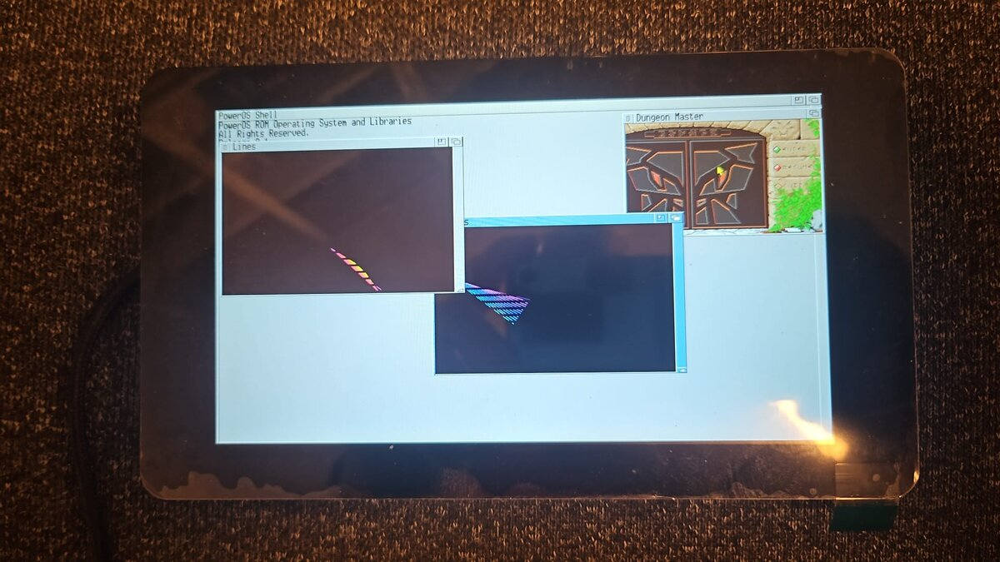

# PowerOS for ESP32

PowerOS is an operating system for Espressif's ESP32 microcontrollers,
written in Zig. It boots straight from the chip's ROM loader - no ESP-IDF,
no second-stage bootloader - and brings up a complete little system:
a multitasking kernel with libraries and devices behind jump tables,
message passing, a DOS with processes, file systems and a shell, and a
windowed desktop with screens, windows, menus, gadgets and requesters on
the board's display.

Programs are loaded from the flash disk or an SD card at run time, and are
built against a separate SDK package - so writing one needs nothing of the
kernel's source.

**Status: release 0.1.** It runs on the ESP32-S3 boards below and in
Espressif's QEMU. The ESP32-P4 is next.

[](docs/screenshots/README.md)

[](docs/screenshots/README.md#the-shell)

[](docs/screenshots/README.md#on-the-board)

More in [the screenshots](docs/screenshots/README.md): a game in a window
of its own, fonts, menus, a requester and gadgets.

## What PowerOS is - and what it is not

**It is** a desktop-style operating system small enough to read. The
whole system - kernel, DOS, file systems, graphics, windows - is well
under a megabyte of code, written in Zig, and runs on a microcontroller
that costs a few euros. It is built from small modules that
talk through message ports and jump tables: a library or a device can be
replaced, added from disk or patched at run time, and a program is a file
that is loaded, run and unloaded.

**It is** made for the ESP32 family. It drives the chip itself, register by
register - clock, MMU, PSRAM, interrupt matrix, DMA, display controller -
so everything between the power-on and the desktop is in this tree.

**It is** a young project. 0.1 is the first release: the system works end
to end, but the API may still change before 1.0, and not every part has
run on every board.

**It is not** a Linux, a POSIX system or an RTOS in the usual sense.
Programs use the system's own API - libraries opened by name, tag lists,
messages - and there is no `libc`, no `fork`, no file descriptors.

**It is not** an AmigaOS clone. It takes the ideas of AmigaOS - exec's
libraries, devices and message ports, dos with its handlers and packets,
screens and windows, classes of gadgets - and builds them anew for this
machine and this language, keeping the model and leaving the old
machine's baggage behind.

**It is not** an emulator. It runs no Amiga software, and no software
written for any other machine: programs are native code for the chip,
built with Zig against the SDK.

**It is not** a protected system. All tasks share one address space, and
a program that writes where it should not can bring the system down. It is
a machine for one person at a time, not a server.

**It does not (yet)** have networking (no Wi-Fi or Bluetooth drivers), USB
host support, or a second CPU core: it runs on one of the chip's two
cores.

### How it differs from AmigaOS

- **No 68000, no custom chips.** Graphics are retargetable from the start
  (rtg.library): true colour on whatever panel the board has, drawn through
  the chip's DMA and display controller - no bitplanes, copper or blitter.
- **No BCPL legacy.** No BPTRs, no BSTRs, no 16-bit data: pointers are
  pointers, strings are C strings, sizes are 32 or 64 bits wide.
- **Packets are messages.** A dos packet is an exec message with typed
  arguments, not a message pointing at a packet pointing back.
- **Own load files.** Programs are ELF files turned into the system's own
  `.seg` format by `elf2seg`, with only the relocations an address needs.
- **Tag lists where there were accessors.** A RastPort is opaque and set
  with `SetRPAttrs`; new libraries take tags rather than growing a call
  for every field.
- **New jobs get a new API.** Where this machine needs something the old
  one did not - expansion.library describing a board, platform.resource
  describing the chip - the calls are designed for that job, even where a
  name is reused, instead of keeping inherited slots.
- **Boards are data.** What is fitted and how it is wired is a tag list in
  the ROM; a driver asks for its part at run time instead of assuming a
  machine.
- **Today's terminal.** The console speaks VT100 with the parts of xterm
  programs expect, 256 colours included.
- **Today's storage.** A log-structured file system for the on-board
  flash, and FAT32 for SD cards, instead of floppy-era formats.
- **Zig, with its safety checks.** The system is built in ReleaseSafe:
  overflows, bad casts and out-of-range indices are caught instead of
  corrupting memory, and the SDK is a Zig package.

## What is in it

**Kernel (exec)**
- Preemptive multitasking with priorities, signals, message ports,
  semaphores and software interrupts.
- Libraries and devices with jump tables, opened by name, loaded from disk
  on demand and expunged when memory runs short.
- Internal SRAM and 8 MiB of octal PSRAM, managed as memory with
  attributes (`MEMF_INTERNAL`, `MEMF_EXTERNAL`, `MEMF_DMA`).
- The CPU at 240 MHz, code executing from flash through the cache and MMU,
  interrupts routed through the chip's interrupt matrix.

**DOS**
- Processes, packets, handlers started on first use, assigns and paths,
  pattern matching, `ReadArgs` templates, and load files (`.seg`) read by
  `LoadSeg`.
- File systems: a log-structured flash file system that survives power
  cuts and levels wear (`DH0:`), FAT32 on SD cards with long names (`SD0:`),
  `RAM:`, `PIPE:` and `NIL:`.
- Consoles `CON:`, `RAW:` and `AUX:` with line editing, history, and
  copy and paste by mouse and keyboard.
- A shell with variables, aliases, redirection, scripts and resident
  commands, and 26 commands in `C:` - `Dir`, `List`, `Copy`, `Assign`,
  `Info`, `Format`, `Mount`, `Version` and more - with test programs for
  the devices and libraries in `C:test`.

**Graphics and windows**
- rtg.library for the displays and their drivers, graphics.library for
  drawing (lines, fills, blits, text, the system's own `pospaz.font` at 8
  and 16 rows), layers.library for overlapping windows.
- intuition.library: screens, windows, menus, requesters, and an object
  system of classes for gadgets and images (buttons, sliders, string
  fields, groups). Several screens share a display, each in a buffer of
  its own, brought forward by showing that buffer; a screen can be double
  buffered, its frames flipped at the display's frame start. Public
  screens can be listed, chosen as the default and signal their owner when
  the last visitor leaves; gadgets can live in a window's border.

**Devices**
- Timer, serial, USB serial, flash, SD card, I2C, touch, keyboard, mouse,
  input, console and four-channel audio; watchdog, DMA, GPIO and platform
  resources.
- Board facts - which parts are fitted and how they are wired - are data
  in a board description, and drivers ask for their part at run time.

## Boards

| `-Dboard=` | Board | State |
|---|---|---|
| `waveshare_7b` (default) | Waveshare ESP32-S3-Touch-LCD-7B: 7" 1024×600 RGB panel, GT911 touch, 16 MB flash, 8 MB PSRAM | runs |
| `es3c35p` | LCDwiki ES3C35P: 3.5" 480×320 QSPI panel, touch, ES8311 audio codec, SD card slot | runs: panel, touch, speaker, card |
| `qemu` | Espressif QEMU's ESP32-S3, with display, keyboard and mouse | runs |

`C:ShowConfig` lists what the running board has.

## Quick start

You need Linux or macOS, `esptool` (v5) to flash, and for the emulator
Espressif's QEMU. Always build with the `./zig` wrapper: it fetches the
Espressif Zig toolchain (`0.16.0-xtensa`) into `toolchain/` on first use.

```sh
./zig build                  # the kernel and a flash disk: zig-out/bin/flash.bin
./zig build test             # host tests; every board and every program compiles
./zig build qemu             # boot in QEMU on the serial console (quit: Ctrl-A X)
./zig build qemu-display     # the same with the display in a window
./zig build flash-all -Dport=/dev/ttyACM0   # kernel and a fresh disk onto a board
```

For the display in QEMU, build the patched QEMU once with
`scripts/build-qemu.sh` (into `toolchain/qemu/`): it adds the 1024×600
display with keyboard and mouse and room in it for four pictures, and runs
the core at 240 MHz. An older build still runs, with room for two.

More build steps and options:

| Command | What it does |
|---|---|
| `./zig build -Dboard=es3c35p` | any step for another board |
| `./zig build flash` | the kernel only; the disk is kept |
| `./zig build flash-disk` | a fresh, empty file system on the board's disk |
| `./zig build qemu-disk` | QEMU on an image whose disk keeps what is written |
| `./zig build fd` | regenerate the SDK's interfaces from its `.fd` files |
| `./zig build autodoc` | regenerate the SDK's autodocs from the doc comments |
| `-Dextra=c/hello=path/to/hello.seg` | put a file built elsewhere on the disk image |

On a board the serial console is the chip's USB port
(e.g. `tio /dev/ttyACM0`); the display comes up with a shell window.

## Writing a program

The SDK (`sdk/`) is a Zig package of its own. A program depends on it and
builds with `addProgram`, which knows the chip, the linker script and how
to make the load file. Every library, device and resource call is
described in [`sdk/docs/autodocs/`](sdk/docs/README.md), one file per
module.

```zig
// build.zig
const std = @import("std");
const poweros_sdk = @import("poweros_sdk");

pub fn build(b: *std.Build) void {
    const sdk = b.dependency("poweros_sdk", .{});
    const seg = poweros_sdk.addProgram(b, sdk, .{ .name = "hello", .root = b.path("hello.zig") });
    b.getInstallStep().dependOn(&b.addInstallBinFile(seg, "hello.seg").step);
}
```

### Hello, world - in the shell

A command is a function `_program_entry` that gets exec's base. It opens
the libraries it needs by name and closes them again:

```zig
// hello.zig
const sdk = @import("sdk");
const dos = sdk.dos;
const ExecBase = sdk.interface.exec.ExecBase;
const DosBase = sdk.interface.dos.DosBase;

export fn _program_entry(sys: *ExecBase, _: [*]const u8, _: usize) callconv(.c) i32 {
    const dos_lib = sys.OpenLibrary(dos.DOSNAME, 0) orelse return dos.RETURN_FAIL;
    defer sys.CloseLibrary(dos_lib);
    const dl: *DosBase = @ptrCast(dos_lib);

    _ = dos.stdio.Printf(dl, "Hello, world!\n", .{});
    return dos.RETURN_OK;
}
```

### Hello, world - in a window

The same with intuition.library and graphics.library: a window on the
default screen, the words drawn into its RastPort, and its messages
waited for until the close gadget is used or Ctrl-C comes:

```zig
// window.zig
const sdk = @import("sdk");
const dos = sdk.dos;
const exec = sdk.exec;
const graphics = sdk.graphics;
const intuition = sdk.intuition;
const wn = intuition.windows;
const TagItem = sdk.utility.TagItem;
const ExecBase = sdk.interface.exec.ExecBase;
const GraphicsBase = sdk.interface.graphics.GraphicsBase;
const IntuitionBase = sdk.interface.intuition.IntuitionBase;

export fn _program_entry(sys: *ExecBase, _: [*]const u8, _: usize) callconv(.c) i32 {
    const int_lib = sys.OpenLibrary(intuition.INTUITIONNAME, 0) orelse return dos.RETURN_FAIL;
    defer sys.CloseLibrary(int_lib);
    const ib: *IntuitionBase = @ptrCast(int_lib);
    const gfx_lib = sys.OpenLibrary(graphics.GRAPHICSNAME, 0) orelse return dos.RETURN_FAIL;
    defer sys.CloseLibrary(gfx_lib);
    const gb: *GraphicsBase = @ptrCast(gfx_lib);

    // A window on the default screen, with a close gadget that tells us so.
    const w = ib.OpenWindowTagList(&[_]TagItem{
        .{ .tag = wn.WA_Title, .data = @intFromPtr("Hello") },
        .{ .tag = wn.WA_InnerWidth, .data = 240 },
        .{ .tag = wn.WA_InnerHeight, .data = 60 },
        .{ .tag = wn.WA_CloseGadget, .data = 1 },
        .{ .tag = wn.WA_DragBar, .data = 1 },
        .{ .tag = wn.WA_DepthGadget, .data = 1 },
        .{ .tag = wn.WA_Activate, .data = 1 },
        .{ .tag = wn.WA_IDCMP, .data = wn.IDCMP_CLOSEWINDOW },
        .{},
    }) orelse return dos.RETURN_FAIL;
    defer ib.CloseWindow(w);

    // The window's RastPort, and where the inside starts.
    var rp_addr: usize = 0;
    var left: usize = 0;
    var top: usize = 0;
    ib.GetWindowAttrs(w, &[_]TagItem{
        .{ .tag = wn.WA_RastPort, .data = @intFromPtr(&rp_addr) },
        .{ .tag = wn.WA_BorderLeft, .data = @intFromPtr(&left) },
        .{ .tag = wn.WA_BorderTop, .data = @intFromPtr(&top) },
        .{},
    });
    const rp: *graphics.RastPort = @ptrFromInt(rp_addr);

    // The words, in the screen's text pen.
    const text = "Hello, world!";
    gb.Move(rp, @intCast(left + 20), @intCast(top + 35));
    gb.Text(rp, text, text.len);

    // Wait until the close gadget is used, or Ctrl-C comes.
    while (true) {
        const got = ib.WaitIMsg(w, exec.SIGBREAKF_CTRL_C);
        if (got & exec.SIGBREAKF_CTRL_C != 0) return dos.RETURN_WARN;
        while (ib.GetIMsg(w)) |im| {
            const class = im.class;
            ib.ReplyIMsg(im);
            if (class == wn.IDCMP_CLOSEWINDOW) return dos.RETURN_OK;
        }
    }
}
```

Each gets its own `addProgram` in `build.zig`, as `hello` above, and
`zig build` makes `zig-out/bin/hello.seg` and `window.seg`. Put them on
the disk with `-Dextra=c/hello=path/to/hello.seg` (or drop them into the
tree's `disk/c/`), and run them from the shell: `hello`, or `run window`
so the shell stays free while the window is open.

The programs in `src/disk/c/` are all built this way and are the best
examples: each opens its libraries, reads its arguments with a `ReadArgs`
template and carries a `$VER:` string.

## Repository layout

```
src/arch/      the chip: boot, exceptions, clock, MMU, PSRAM, interrupts
src/rom/       what is in the ROM: libraries, devices, handlers, resources, shell
src/boards/    one folder per board: its parts and wiring, and its drivers
src/disk/      what goes on the disk: commands, test programs, disk-loaded
               libraries, devices and handlers, startup scripts (a package)
sdk/           the SDK: types, constants, jump tables, autodocs, tools (a package)
tools/         build helpers: mkfs, ressize, checks
scripts/       the QEMU build and a serial terminal
```

## License

Copyright (c) 2026 Claus Herrmann and the PowerOS contributors.

- **The system** - everything outside `sdk/` and `src/disk/` - is under
  the [Mozilla Public License 2.0](LICENSE): a changed file stays under it
  and its source is published with what ships it; new files of one's own,
  such as a driver or a board, may be under any license.
- **The SDK** (`sdk/`) and **the disk's programs** (`src/disk/`) are under
  the [MIT license](sdk/LICENSE), so a program built against the SDK is
  its author's to license as they like.
- `scripts/qemu/esp_rgb_input.patch` changes QEMU and is under QEMU's
  license, GPL-2.0-or-later.

Every source file names its license in its first line
(`SPDX-License-Identifier`).
