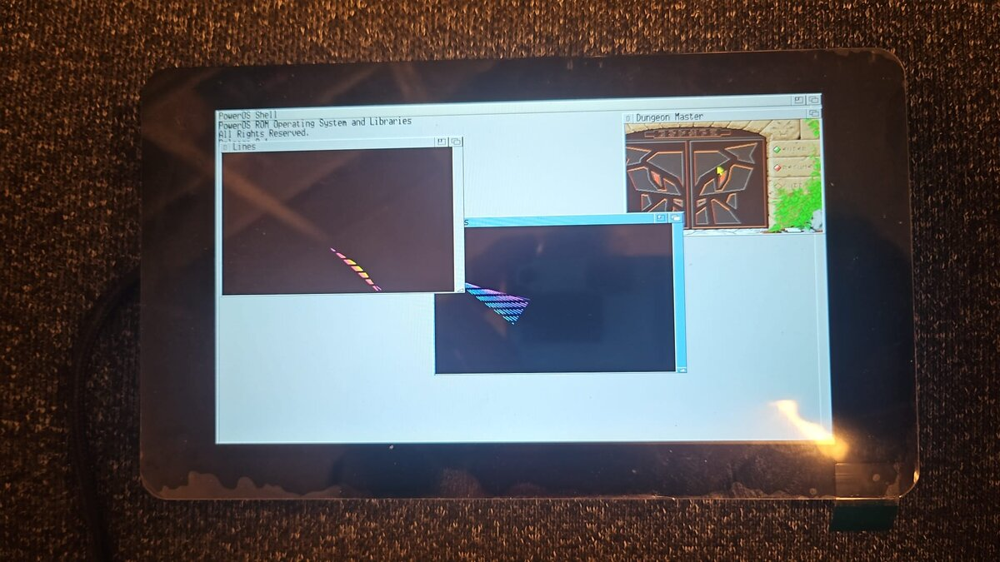
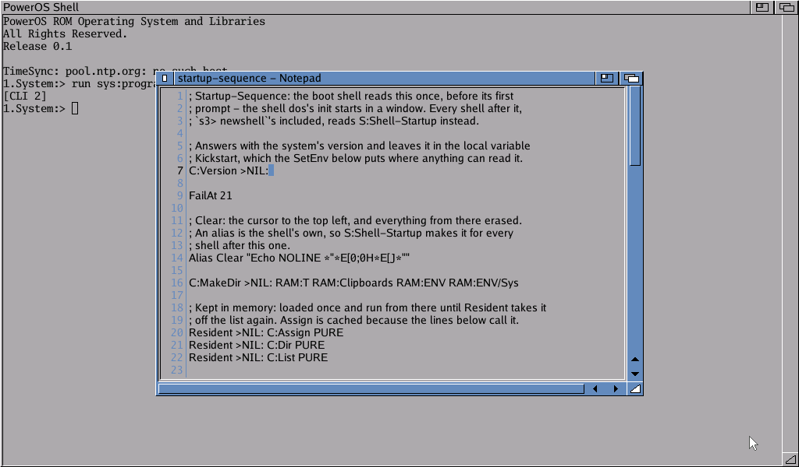
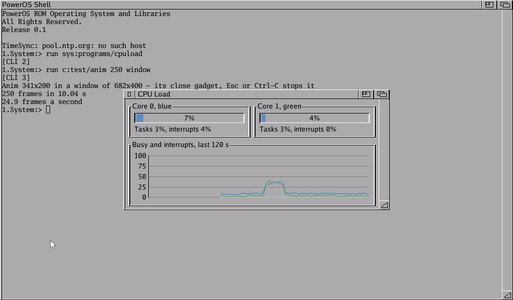

# PowerOS for ESP32

PowerOS is an operating system for Espressif's ESP32 microcontrollers,
written in Zig. It boots straight from the chip's ROM loader and brings up
a complete little system: a multitasking kernel with libraries and
devices, a DOS with file systems and a shell, a TCP/IP stack, and a
windowed desktop on the board's display. Programs are loaded from disk at
run time and built against a separate SDK.

**Status: release 0.1.** It runs on two ESP32-S3 boards and in
Espressif's QEMU. The ESP32-P4 is next.

[](docs/screenshots/README.md#on-the-board)

<p>
<a href="docs/screenshots/README.md#notepad-sysprogramsnotepad"></a>
<a href="docs/screenshots/README.md#cpu-load-sysprogramscpuload"></a>
</p>

## Contents

| | |
|---|---|
| [Screenshots](docs/screenshots/README.md) | the shell, Notepad, CPU load, drawing, a game, fonts, menus, gadgets, on the boards |
| [What PowerOS is - and what it is not](#what-poweros-is---and-what-it-is-not) | the idea, and what is in it |
| [Quick start](#quick-start) | boards, building, QEMU, flashing |
| [Writing programs](sdk/docs/guides/programs.md) | examples: hello in the shell, a window, buttons |
| [The SDK](sdk/) | the package a program builds against |
| [Autodocs](sdk/docs/README.md) | every call, and every module by kind |
| [Guides](sdk/docs/README.md#guides) | how the calls work together: [exec](sdk/docs/guides/exec.md), [dos](sdk/docs/guides/dos.md), [utility](sdk/docs/guides/utility.md), [intuition](sdk/docs/guides/intuition.md), [fonts](sdk/docs/guides/fonts.md), [styles](sdk/docs/guides/styles.md), [motion](sdk/docs/guides/motion.md), [datatypes](sdk/docs/guides/datatypes.md), [network](sdk/docs/guides/network.md), [disks](sdk/docs/guides/rdb.md), [Modbus](sdk/docs/guides/modbus.md), [displays](sdk/docs/guides/rtg.md) |
| [Wi-Fi](docs/wifi.md) | the radio's device, and how it is built |
| [Example programs](src/disk/c/) | every command on the disk, built the same way |
| [Repository layout](#repository-layout) | where things are |
| [License](#license) | MPL-2.0 for the system, MIT for the SDK and programs |

## What PowerOS is - and what it is not

- **It is** a desktop-style operating system small enough to read: kernel,
  DOS, file systems, network, graphics and windows in well under a
  megabyte of code, on a microcontroller that costs a few euros. It is
  built from small modules that talk through message ports and jump
  tables; a library or a device can be replaced, loaded from disk or
  patched at run time.
- **It is** made for the ESP32 family. It drives the chip itself, register
  by register, so everything between power-on and the desktop is in this
  tree.
- **It is** young. 0.1 works end to end, but the API may change before
  1.0, and not every part has run on every board.
- **It is not** a Linux, a POSIX system or an RTOS in the usual sense:
  programs use the system's own API - libraries opened by name, tag lists,
  messages - with no `libc` and no `fork`.
- **It is not** an AmigaOS clone or emulator. It takes AmigaOS's ideas -
  exec's libraries, devices and message ports, dos with handlers and
  packets, screens, windows and gadget classes - and builds them anew for
  this machine: no BCPL pointers or strings, 32- and 64-bit data,
  retargetable true-colour graphics, boards described as data. It runs no
  Amiga software.
- **It is not** a protected system. All tasks share one address space; it
  is a machine for one person at a time.
- **It does not (yet)** have Bluetooth or USB host support.

### What is in it

- **Kernel (exec):** preemptive multitasking on both of the chip's cores - a
  dispatcher per core, one ready list, tasks pinned to a core where they
  must be - signals, message ports, semaphores, spinlocks with checked
  rules, and every system list under a lock of its own, so neither core
  ever stops the other; libraries and devices opened by name, each under
  its own lock, loaded from disk on demand and expunged when memory runs
  short; internal SRAM and 8 MiB of
  PSRAM as memory with attributes. A system log from the first byte of
  the boot, with levels, on the USB console where UART0 is not wired, and
  to a syslog server (`C:Log`). A Guru that names the failed check and
  offers a ROM debugger - registers, memory, backtrace, breakpoints,
  single step - on the serial ports, and unanswered restarts the machine,
  whose next boot shows the last words before it. A program that fails is
  held and asked about on the display - Software Failure, Suspend or
  Reboot - while the system runs on. `SYS:Programs/CPULoad` charts how
  busy each core is, in tasks and in interrupts.
- **DOS:** processes, handlers, assigns, patterns, `ReadArgs`, names of
  255 characters; a log-structured flash file system (`DH0:`), FAT32 and
  exFAT on SD cards (`SD0:`), `RAM:`, `PIPE:`, `NIL:`; partitions from
  the disk's RigidDiskBlock (`LIBS:rdb.library`, `C:RDB`, the
  [disks guide](sdk/docs/guides/rdb.md)); consoles with line editing,
  Tab completion of file names, and copy and paste; a shell with scripts and resident commands, 38
  commands in `C:` (`dir all | more` pages through anything), test
  programs in `C:test` and network tools in `C:net`.
- **Datatypes:** `LIBS:datatypes.library` opens a file by what is in it
  and hands back an object a program puts in a window - pictures (ILBM,
  BMP, PNG, GIF, JPEG), text (plain, FTXT, Markdown) and animations
  (animated GIF, Lottie). `SYS:Programs/MultiView` shows any of them;
  `LIBS:iffparse.library` and `DEVS:clipboard.device` carry IFF between
  programs. See the [datatypes guide](sdk/docs/guides/datatypes.md).
- **Graphics and windows:** rtg.library for the displays;
  graphics.library with smooth curves and lines, rounded rectangles,
  gradients, shadows and scaled pictures; layers.library; and
  intuition.library - screens, pulled down by their title bar to show
  the ones behind, windows, menus, requesters, and gadget classes in
  layouts that fit any display; the mouse wheel scrolls or steps
  whatever is under the pointer. Everything is drawn from a
  style a screen carries, so the look changes with no program changed
  (the [styles guide](sdk/docs/guides/styles.md)). More gadget classes
  in `SYS:classes/gadgets/`: tabs, number fields, pop-up lists, progress
  bars, dials, knobs, a calendar, charts, rich text, QR codes and
  barcodes, a keyboard on the screen for a board with none
  (`C:test/Widgets`), text of many lines to edit, with undo, the
  clipboard, finding and line numbers - what `SYS:Programs/Notepad` is
  made of - a form larger than its window, scrolled
  (`C:test/Scroll`), and a list in columns under headings that sort it,
  its rows a tree (`C:test/ListBrowser`).
  `LIBS:asl.library` asks for a file or a font.
- **Motion:** motion.library, one clock for everything that moves -
  eased values, timers that do not drift, timelines; a style change
  fades, a gauge fills, a list glides. See the
  [motion guide](sdk/docs/guides/motion.md).
- **Settings:** `SYS:Programs/Prefs` edits the look, the pens, the fonts,
  the input, and whether windows may be moved partly past the screen's
  edges, in one window; every open window takes a change at once, and
  `C:SetPrefs` hands them over at boot.
- **Fonts:** bitmap and TrueType, any size, smooth or in colour, shown
  by `SYS:Programs/FontView`. See the
  [fonts guide](sdk/docs/guides/fonts.md).
- **Network:** a TCP/IP stack of its own (`LIBS:bsdsocket.library`: TCP,
  UDP, IPv4 and IPv6, DHCP, DNS) on QEMU's Ethernet and the chip's Wi-Fi
  (WPA2), and a shell over Telnet (`C:net/ShellServer`);
  `LIBS:tls.library` with TLS 1.3 and 1.2, so `C:net/HTTPGet` fetches
  `https://`. See the [network guide](sdk/docs/guides/network.md).
- **Modbus:** `LIBS:modbus.library` asks devices and answers as one,
  over RTU on the RS-485 bus and over TCP; `C:Modbus` reads and writes
  a device from the shell, and `SYS:Programs/Battery` shows a battery a
  Victron GX device reports. See the [Modbus guide](sdk/docs/guides/modbus.md).
- **Devices:** timer, serial, USB serial, RS-485 (in frames), flash, SD
  card, I2C, touch, keyboard, mouse (with its wheel), input, console, four-channel audio,
  Telnet; watchdog, DMA, GPIO, IO expander and platform resources; `LIBS:crypto.library` on the chip's SHA,
  AES and RSA engines - hashes, AES-GCM, X25519, P-256 and P-384, RSA,
  ECDSA and Ed25519 signatures.
- **Boards are data:** which parts are fitted and how they are wired is a
  description in the ROM; drivers ask for their part at run time.

## Quick start

### Boards

| `-Dboard=` | Board | State |
|---|---|---|
| `waveshare_7b` (default) | Waveshare ESP32-S3-Touch-LCD-7B: 7" 1024×600 RGB panel, GT911 touch, 16 MB flash, 8 MB PSRAM, microSD slot on SPI, RS-485, CAN, battery charger | runs: panel, touch, Wi-Fi, card slot on SPI; RS-485 driven, not yet tried on the board; CAN described but not driven |
| `es3c35p` | LCDwiki ES3C35P: 3.5" 480×320 QSPI panel, touch, ES8311 audio codec, SD card slot | runs: panel, touch, speaker, card |
| `qemu` | Espressif QEMU's ESP32-S3, with display, keyboard and a mouse with a wheel, and an RS-485 port on its second serial port | runs |

`C:ShowConfig` lists what the running board has.

You need Linux or macOS, `esptool` (v5) to flash, and for the emulator
Espressif's QEMU. Always build with the `./zig` wrapper: it fetches the
Espressif Zig toolchain (`0.16.0-xtensa`) into `toolchain/` on first use.

```sh
./zig build                  # the kernel and a flash disk: zig-out/bin/flash.bin
./zig build test             # host tests; every board and every program compiles
./zig build qemu             # boot in QEMU on the serial console (quit: Ctrl-A X)
./zig build qemu-display     # the same with the display in a window
./zig build flash-all -Dport=/dev/ttyACM0   # kernel and a fresh disk onto a board
```

Fetched once into `toolchain/`, pinned and checked, never committed:

| Script | For |
|---|---|
| `scripts/build-qemu.sh` | QEMU with the 1024×600 display, keyboard, mouse and wheel, at 240 MHz (an older QEMU runs too, without what it lacks - run the script again for the wheel) |
| `scripts/fetch-wifi.sh` | the radio's vendor libraries for `DEVS:networks/wifi.device` |
| `scripts/fetch-fonts.sh` | the fonts in `FONTS:` (Spleen, Go) |
| `scripts/fetch-certs.sh` | Mozilla's root certificates, made into the trust store `SYS:Certificates/Roots` |

Without them the disk has everything but that part. On a board the serial
console is the chip's USB port (e.g. `tio /dev/ttyACM0`); the display
comes up with a shell window, opened once S:Startup-Sequence has set the
system's fonts, pens and style - or as soon as the script prints
something.

More build steps and options:

| Command | What it does |
|---|---|
| `./zig build -Dboard=es3c35p` | any step for another board |
| `./zig build flash` | the kernel only; the disk is kept |
| `./zig build flash-disk` | a fresh, empty file system on the board's disk |
| `./zig build qemu-disk` | QEMU on an image whose disk keeps what is written |
| `./zig build fd` | regenerate the SDK's interfaces from its `.fd` files |
| `./zig build autodoc` | regenerate the SDK's autodocs from the doc comments |
| `./zig build modchart` | regenerate the charts of which module uses which (`sdk/docs/modules.md`) |
| `-Dextra=c/hello=path/to/hello.seg` | put a file built elsewhere on the disk image |
| `-Dnet=none` | the `qemu*` steps without a network, or another QEMU `-nic` backend |
| `-Dnet-dump=net.pcap` | every frame of the `qemu*` steps' network, for Wireshark |
| `-Dtelnet=2323` | forward that host port to the machine's port 23 (`C:net/ShellServer`) |
| `-Drs485=tcp::5020,server,nowait` | the `qemu*` steps' RS-485 port (`rs485.device`) on that QEMU serial backend |
| `-Dcores=1` | the cores the kernel runs on: 1 or 2 (default: what the board says - two on every board and in `qemu`) |

## Repository layout

```
src/arch/      the chip: boot, exceptions, clock, MMU, PSRAM, interrupts
src/rom/       what is in the ROM: libraries, devices, handlers, resources, shell
src/boards/    one folder per board: its parts and wiring, and its drivers
src/disk/      what goes on the disk: commands, test programs, disk-loaded
               libraries, devices and handlers, startup scripts (a package)
sdk/           the SDK: types, constants, jump tables, autodocs, tools (a package)
tools/         build helpers: mkfs, ressize, the autodocs, the module charts, checks
scripts/       the QEMU build, the pinned fetches (Wi-Fi libraries, fonts, certificates), a serial terminal
```

## License

Copyright (c) 2026 Claus Herrmann and the PowerOS contributors.

- **The system** - everything outside `sdk/` and `src/disk/` - is under
  the [Mozilla Public License 2.0](LICENSE): a changed file stays under it
  and its source is published with what ships it; new files of one's own,
  such as a driver or a board, may be under any license.
- **The SDK** (`sdk/`) and **the disk's programs** (`src/disk/`) are under
  the [MIT license](sdk/LICENSE), so a program built against the SDK is
  its author's to license as they like.
- `scripts/qemu/esp_rgb_input.patch` changes QEMU and is under QEMU's
  license, GPL-2.0-or-later.
- `C:test/BsdSockTest` (`src/disk/c/test/bsdsocktest/`) is Thomas Dye's
  bsdsocktest in Zig and under its license,
  [GPL-3.0-only](src/disk/c/test/bsdsocktest/LICENSE); the disk image
  holds it as a program of its own.

Every source file names its license in its first line
(`SPDX-License-Identifier`).
