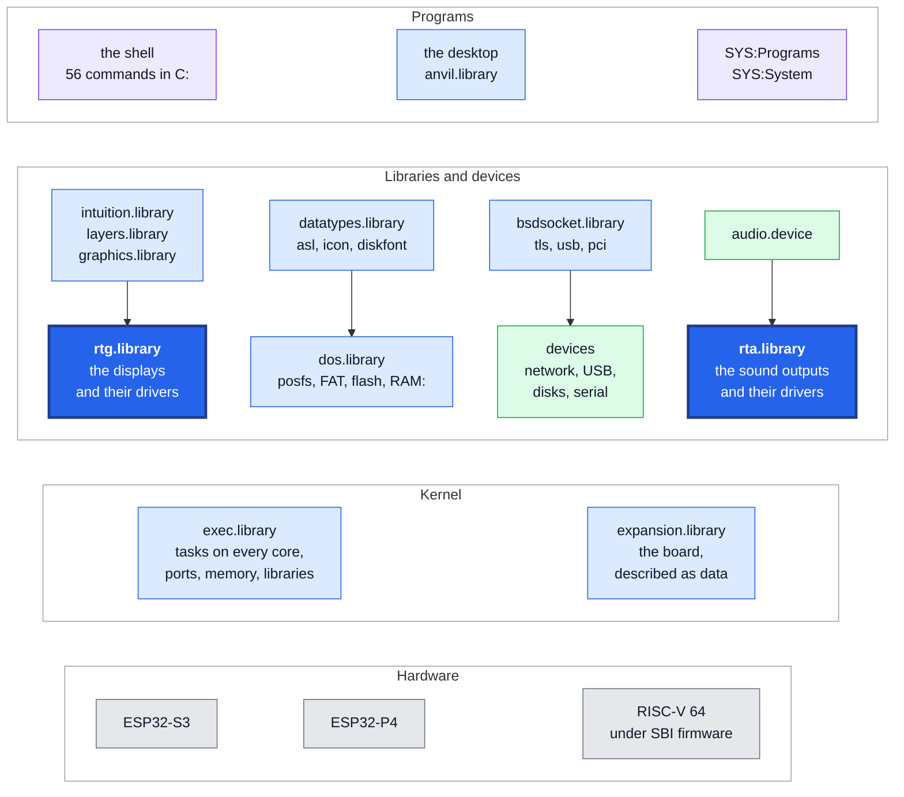

# PowerOS

PowerOS is an operating system for Espressif's ESP32 microcontrollers and
for 64-bit RISC-V machines, written in Zig. It boots straight from an
ESP32's ROM loader, or from a RISC-V machine's SBI firmware, and brings up
a complete little system: a multitasking kernel with libraries and
devices, a DOS with file systems and a shell, a TCP/IP stack, and a
windowed desktop on the board's display. Programs are loaded from disk at
run time and built against a separate SDK.

**Status: release 0.2.** It runs on two ESP32-S3 boards, on two
ESP32-P4 boards, on StarFive's VisionFive 2 (RISC-V 64), in Espressif's
QEMU and in QEMU's RISC-V 64 `virt` machine.

[](docs/screenshots/README.md#on-the-board)

<p>
<a href="docs/screenshots/README.md#music-sysprogramsplayer"></a>
<a href="docs/screenshots/README.md#music-sysprogramsplayer"></a>
</p>
<p>
<a href="docs/screenshots/README.md#the-desktop-anvil"></a>
<a href="docs/screenshots/README.md#notepad-sysprogramsnotepad"></a>
</p>
<p>
<a href="docs/screenshots/README.md#on-the-board"></a>
<a href="docs/screenshots/README.md#on-the-board"></a>
</p>

## Contents

| | |
|---|---|
| [Screenshots](docs/screenshots/README.md) | the Player, the shell, Notepad, HDToolBox, CPU load, drawing, a game, fonts, menus, gadgets, on the boards |
| [What PowerOS is - and what it is not](#what-poweros-is---and-what-it-is-not) | the idea, and what is in it |
| [Quick start](#quick-start) | boards, building, [QEMU the first time](#first-time-in-qemu), flashing, [the RISC-V machines](#the-risc-v-machines) |
| [Writing programs](sdk/docs/guides/programs.md) | examples: hello in the shell, a window, buttons |
| [Debugging](sdk/docs/guides/debugging.md) | what a failure prints, from an address to a line, the ROM debugger, `s3>`, memory debugging, JTAG |
| [The SDK](sdk/) | the package a program builds against |
| [Autodocs](sdk/docs/README.md) | every call, and every module by kind |
| [Guides](sdk/docs/README.md#guides) | how the calls work together: [exec](sdk/docs/guides/exec.md), [dos](sdk/docs/guides/dos.md), [posfs](sdk/docs/guides/posfs.md), [utility](sdk/docs/guides/utility.md), [intuition](sdk/docs/guides/intuition.md), [desktop](sdk/docs/guides/anvil.md), [icons](sdk/docs/guides/icons.md), [fonts](sdk/docs/guides/fonts.md), [styles](sdk/docs/guides/styles.md), [motion](sdk/docs/guides/motion.md), [datatypes](sdk/docs/guides/datatypes.md), [network](sdk/docs/guides/network.md), [USB](sdk/docs/guides/usb.md), [disks](sdk/docs/guides/rdb.md), [Modbus](sdk/docs/guides/modbus.md), [sound](sdk/docs/guides/audio.md), [displays](sdk/docs/guides/rtg.md) |
| [Wi-Fi](docs/esp32s3wifi.md) | the ESP32-S3's radio's device, and how it is built |
| [USB Wi-Fi](docs/aic8800.md) | the AIC8800 stick's device, and how it is built |
| [posfs](docs/posfs.md) | the PowerOS file system: its format on the medium, field by field, and how it works |
| [Example programs](src/disk/c/) | every command on the disk, built the same way |
| [Repository layout](#repository-layout) | where things are |
| [License](#license) | MPL-2.0 for the system, MIT for the SDK and programs |

## What PowerOS is - and what it is not

- **It is** a desktop-style operating system small enough to read: kernel,
  DOS, file systems, network, graphics and windows in well under a
  megabyte of code, on a microcontroller that costs a few euros. It is
  built from small modules that talk through message ports and jump
  tables; a library or a device can be replaced, loaded from disk or
  patched at run time.
- **It is** made for the ESP32 family, and runs on 64-bit RISC-V
  machines under SBI firmware too. It drives the hardware itself,
  register by register: on an ESP32 everything between power-on and the
  desktop is in this tree, on a RISC-V machine everything after its
  firmware hands over.
- **It is** young. 0.2 works end to end, but the API may change before
  1.0, and not every part has run on every board.
- **It is not** a Linux, a POSIX system or an RTOS in the usual sense:
  programs use the system's own API - libraries opened by name, tag lists,
  messages - with no `libc` and no `fork`.
- **It is not** an AmigaOS clone or emulator. It takes AmigaOS's ideas -
  exec's libraries, devices and message ports, dos with handlers and
  packets, screens, windows and gadget classes - and builds them anew for
  this machine: no BCPL pointers or strings, 32- and 64-bit data,
  retargetable true-colour graphics, boards described as data. It runs no
  Amiga software.
- **It is not** a protected system. All tasks share one address space; it
  is a machine for one person at a time.
- **It does not (yet)** have Bluetooth.

### What is in it


```mermaid
flowchart TB
    subgraph m_programs ["Programs"]
        m_shell["the shell<br/>56 commands in C:"]
        m_desktop["the desktop<br/>anvil.library"]
        m_apps["SYS:Programs<br/>SYS:System"]
    end

    subgraph m_modules ["Libraries and devices"]
        m_intuition["intuition.library<br/>layers.library<br/>graphics.library"]
        m_datatypes["datatypes.library<br/>asl, icon, diskfont"]
        m_network["bsdsocket.library<br/>tls, usb, pci"]
        m_audio["audio.device"]
        m_rtg["<b>rtg.library</b><br/>the displays<br/>and their drivers"]
        m_dos["dos.library<br/>posfs, FAT, flash, RAM:"]
        m_devices["devices<br/>network, USB,<br/>disks, serial"]
        m_rta["<b>rta.library</b><br/>the sound outputs<br/>and their drivers"]
    end

    subgraph m_kernel ["Kernel"]
        m_exec["exec.library<br/>tasks on every core,<br/>ports, memory, libraries"]
        m_expansion["expansion.library<br/>the board,<br/>described as data"]
    end

    subgraph m_hardware ["Hardware"]
        m_s3["ESP32-S3"]
        m_p4["ESP32-P4"]
        m_rv64["RISC-V 64<br/>under SBI firmware"]
    end

    m_intuition --> m_rtg
    m_datatypes --> m_dos
    m_network --> m_devices
    m_audio --> m_rta

    m_shell ~~~ m_intuition
    m_desktop ~~~ m_datatypes
    m_desktop ~~~ m_network
    m_apps ~~~ m_audio
    m_rtg ~~~ m_exec
    m_dos ~~~ m_exec
    m_devices ~~~ m_expansion
    m_rta ~~~ m_expansion
    m_exec ~~~ m_s3
    m_exec ~~~ m_p4
    m_expansion ~~~ m_rv64

    classDef prog fill:#ede9fe,stroke:#7c3aed,color:#111827
    class m_shell,m_apps prog
    classDef lib fill:#dbeafe,stroke:#2563eb,color:#111827
    class m_desktop,m_intuition,m_datatypes,m_network,m_dos,m_exec,m_expansion lib
    classDef dev fill:#dcfce7,stroke:#16a34a,color:#111827
    class m_audio,m_devices dev
    classDef key fill:#2563eb,stroke:#1e3a8a,stroke-width:3px,color:#ffffff
    class m_rtg,m_rta key
    classDef chip fill:#e5e7eb,stroke:#6b7280,color:#111827
    class m_s3,m_p4,m_rv64 chip
    style m_programs fill:none,stroke:#9ca3af
    style m_modules fill:none,stroke:#9ca3af
    style m_kernel fill:none,stroke:#9ca3af
    style m_hardware fill:none,stroke:#9ca3af
```

Each layer uses the ones below it; libraries are blue, devices green.
Two libraries stand between the hardware and everything a program shows
and plays:

**rtg.library** keeps the displays. Each is a board of a driver, and
graphics.library, layers and intuition draw into its buffers without
knowing what panel is behind them, so one program draws on a 3.5" SPI
panel and on a 1080p monitor alike. A board's engine takes the fills,
copies, blends and scales: the ESP32-P4's PPA and 2D-DMA, the
VisionFive 2's four cores ([displays guide](sdk/docs/guides/rtg.md)).

| Driver | Display |
|---|---|
| `rgb` | the Waveshare 7B's 1024×600 RGB panel |
| `dcs` on `qspi` | the ES3C35P's 480×320 SPI panel |
| `dsi` | the ESP32-P4's MIPI DSI panels, and HDMI through the Olimex's LT8912B |
| `fb` | the VisionFive 2's HDMI at 1920×1080, QEMU virt's `ramfb` |
| `qemu` | Espressif QEMU's display |

**rta.library** keeps the sound outputs and ways in. Each is a sink or a
source of a driver, made from the parts the board's description names,
or when a USB speaker is plugged in. `audio.device` mixes up to sixteen
streams, each in its own form, rate, volume and pan, into one sink; the
output preferred takes over when it is plugged in, each keeps its own
volume (`C:Audio`, Prefs, `SYS:Programs/Volume`) - a USB speaker's at
its own control - a click plays at once
as a trigger, and unit 1 records (`C:Record`). `LIBS:audiocodec.library`
decodes WAV, MP3, FLAC and Ogg Vorbis as they play
([sound guide](sdk/docs/guides/audio.md)).

| Driver | Output |
|---|---|
| `es8311` | the ES8311 codec, and its microphone input |
| `i2samp` | I2S amplifiers, as the CrowPanel's two speakers |
| `hdmi` | the VisionFive 2's HDMI port, 48000 Hz stereo |
| `uac` | USB speakers and headsets (`DEVS:usb/uac.device`) |
| `file` | a WAV file, written in time |
| `null` | in the emulators, an output into nothing that keeps time |

The libraries: exec, utility, expansion, dos, rtg, rta, graphics,
layers, intuition, keymap and motion are in the ROM, the rest are loaded
from `LIBS:` when first opened. Every module, with its reference, is in
[the SDK's documentation](sdk/docs/README.md).

| Area | Libraries |
|---|---|
| Kernel | `exec` tasks on every core, ports, memory, libraries and devices; `utility` tag lists, hooks, dates; `expansion` the board's parts |
| Files | `dos` processes, files, handlers, the shell's `ReadArgs`; `rdb` partitions on any drive |
| Displays | **`rtg`**; `graphics` drawing; `layers`; `intuition` screens, windows, gadgets, styles; `keymap`; `motion` animations and timers |
| Sound | **`rta`**; `audiocodec` WAV, MP3, FLAC, Ogg Vorbis |
| Desktop | `anvil` the desktop; `asl` requesters; `icon`; `datatypes` pictures, text, animations and sounds by what is in them; `iffparse`; `diskfont` and `truetype` fonts; `facet` 3D in Vulkan's model, on the cores |
| Network | `bsdsocket` TCP/IP, IPv4 and IPv6; `tls` 1.3 and 1.2; `crypto`; `wpa` WPA2; `filter` a packet filter |
| Buses | `usb` the USB host stack; `pci` PCI Express; `modbus` RTU and TCP |

Beside them:

- **File systems:** posfs, journaling, copy-on-write, checksummed, with
  snapshots ([posfs guide](sdk/docs/guides/posfs.md)); FAT32 and exFAT
  on cards and sticks; the flash file system (`DH0:`), `RAM:`, `PIPE:`;
  partitions from an RDB or a GPT on any drive, laid out in
  `SYS:System/HDToolBox` ([disks guide](sdk/docs/guides/rdb.md)).
- **Devices:** timer, serial, console, input from keyboards, mice and
  touch, flash, SD card, NVMe, I2C, RS-485, clipboard; USB hosts on the
  ESP32s' OTG and on xHCI, a device plugged in or pulled out told to the
  windows that ask, with class drivers for keyboards, mice,
  sticks, serial and Ethernet adapters, Wi-Fi sticks, and on xHCI
  speakers and headsets
  ([USB guide](sdk/docs/guides/usb.md)); Ethernet up to 1000 Mbit/s, the
  ESP32-S3's Wi-Fi and SLIP, and a shell over Telnet or SSH
  ([network guide](sdk/docs/guides/network.md)).
- **The shell:** 56 commands in `C:`, test programs in `C:test`, network
  tools in `C:net`; scripts, output and errors redirected apart, line
  editing and file name completion ([dos guide](sdk/docs/guides/dos.md)).
- **Programs:** in `SYS:Programs` MultiView, Notepad, Sheet, Terminal,
  Player, FontView, Battery, Prefs and Volume; in `SYS:System` the Shell,
  HDToolBox, CPULoad and MemMap.
- **When something fails:** a Guru and a ROM debugger on the serial
  port, memory debugging, the system log, and a program that fails held
  for Suspend, Kill or Reboot
  ([debugging guide](sdk/docs/guides/debugging.md)).

## Quick start

### Boards

| `-Dboard=` | Board | State |
|---|---|---|
| `waveshare_7b` (default) | Waveshare ESP32-S3-Touch-LCD-7B: 7" 1024×600 RGB panel, GT911 touch, 16 MB flash, 8 MB PSRAM, microSD slot on SPI, RS-485, CAN, battery charger | runs: panel, touch, Wi-Fi, the card slot; not yet tried on the board: RS-485, the battery's voltage, a USB host on its USB-C socket; CAN not driven |
| `es3c35p` | LCDwiki ES3C35P: 3.5" 480×320 QSPI panel, touch, ES8311 audio codec, SD card slot | runs: panel, touch, speaker, card; not yet tried on the board: audio.device 2's streams, recording from the microphone, playing into a file, the battery's voltage, a USB host |
| `qemu` | Espressif QEMU's ESP32-S3, with display, keyboard and a mouse with a wheel, an RS-485 port on its second serial port, and a USB controller with what `-Dusb` plugs in | runs, USB devices plugged in and out while it does (`-Dusb`, `-Dusb-disk`); facet.library's 3D on its 565 display, dithered; sound into an output that goes nowhere |
| `esp32p4_emu` | Espressif's esp-emulator running an ESP32-P4 on the boards' v1.x ROM: both cores, UART0, 32 MB PSRAM (`./zig build emu`) | the shell on UART0, dos with the flash disk and its RISC-V commands, a Guru with the ROM debugger; `-Dselftest` checks the chip; no screen |
| `olimex_p4pc` | Olimex ESP32-P4-PC: ESP32-P4NRW32 (16 MB flash, 32 MB PSRAM), console on the chip's USB port, 10/100 Ethernet (IP101GRR), HDMI, a MIPI-DSI connector (here Olimex's MIPI-LCD2.8, 480×640), four USB host ports, ES8311 audio, microSD | runs: the USB console, Ethernet, the desktop on the DSI panel or over HDMI, in the largest of 1360×768, 1280×720, 1024×768 and 800×600 the monitor names ([photo](docs/screenshots/README.md#on-the-board)), both cores, PSRAM at 200 MHz, the 2D engine and the JPEG codec, USB keyboards, mice and sticks through its hub, the microSD card, sound on the jack (the codec's one output on both sides) - the [Player](docs/screenshots/README.md#music-sysprogramsplayer) on its panel; an AIC8800 USB Wi-Fi stick, joined to WPA2 networks; the battery once its solder jumpers are closed; not yet tried on the board: recording, playing into a file |
| `crowpanel_p4` | Elecrow CrowPanel Advanced 10.1": ESP32-P4NRW32, console on UART0 through a CH340K, 1024×600 MIPI-DSI panel, GT911 touch, ESP32-C6 for Wi-Fi, two speakers on NS4168 I2S amplifiers, two PDM microphones, SD slot | runs: the shell on UART0, the desktop on its panel with touch, both cores, PSRAM at 200 MHz, the 2D engine and the JPEG codec, stereo on its speakers; not yet tried on the board: audio.device 2's streams, playing into a file, the UART1 and UART3-IN connectors |
| `qemu_virt` | QEMU's RISC-V 64 `virt` machine under OpenSBI: four harts, 512 MB, a 16550 console; with QEMU's options a 1920×1080 display (`ramfb`), an xHCI controller and NVMe drives on its PCI Express | runs (`./zig build virt`): the shell on the serial console, four cores, dos on the disk image in RAM; with `-device ramfb` the desktop, with `-device qemu-xhci` USB keyboards, mice and sticks, with an `nvme` device an SSD; sound into an output that goes nowhere, and with `-device usb-audio` through QEMU's USB speaker, sample for sample, plugged in and out as it plays; no network |
| `visionfive2` | StarFive VisionFive 2 (v1.3B): JH7110 with four U74 RISC-V cores, 8 GB LPDDR4, HDMI, two gigabit Ethernet ports, four USB-A on a VL805 on PCI Express, an M.2 slot, microSD; started by the board's own OpenSBI and U-Boot | runs: the console on the debug UART, the desktop over HDMI at 1920×1080, four cores, all of its RAM, starting from the microSD card, the first Ethernet port at 1000 Mbit/s, USB keyboards and mice, an NVMe SSD in the M.2 slot, the random number generator, reboot, the four cores as the 2D engine, facet.library's 3D in a window at 60 frames a second, sound over HDMI; not yet tried on the board: sound through a USB speaker or headset; not driven yet: the second Ethernet port, USB 3, the eMMC socket |

`C:ShowConfig` lists what the running board has, and `ShowConfig DEVICES`
every device by what it speaks - serial lines, block devices, network
devices, ... (`SPEAKS=serial`) - with its units on this board, none of
them opened or loaded to find out.

You need Linux or macOS, `esptool` (v5) to flash, and for the emulator
Espressif's QEMU; for the RISC-V machines `qemu-system-riscv64` and, on
the VisionFive 2, the U-Boot it comes with. Always build with the `./zig`
wrapper: it fetches the Espressif Zig toolchain (`0.16.0-xtensa`) into
`toolchain/` on first use.

```sh
./zig build                  # the kernel and a flash disk: zig-out/bin/flash.bin
./zig build test             # host tests; every board and every program compiles
./zig build qemu             # boot in QEMU on the serial console (quit: Ctrl-A X)
./zig build qemu-display     # the same with the display in a window
./zig build emu              # the ESP32-P4 kernel in esp-emulator (quit: Ctrl-C)
./zig build virt             # the RISC-V 64 kernel in QEMU's virt machine (quit: Ctrl-A X)
./zig build virt-display     # the same with its display, a USB keyboard and a tablet
./zig build flash-all -Dport=/dev/ttyACM0   # kernel and a fresh disk onto a board
```

Fetched once into `toolchain/`, pinned and checked, never committed:

| Script | For |
|---|---|
| `scripts/build-qemu.sh` | QEMU with the 1024×600 display, keyboard, mouse and wheel, and the USB controller, at 240 MHz (an older QEMU runs too, without what it lacks - run the script again for the wheel and USB) |
| `scripts/fetch-wifi.sh` | the radio's vendor libraries for `DEVS:networks/esp32s3wifi.device` |
| `scripts/fetch-aic8800.sh` | the AIC8800 USB Wi-Fi stick's firmware, which `DEVS:usb/aic8800.device` loads into it (the ESP32-P4's disk) |
| `scripts/fetch-fonts.sh` | the fonts in `FONTS:` (Spleen, Go) |
| `scripts/fetch-certs.sh` | Mozilla's root certificates, made into the trust store `SYS:Certificates/Roots` |
| `scripts/fetch-pciids.sh` | the PCI ID Repository's list, `DEVS:pci.ids` on the RISC-V disk, which `C:PCIInfo` names vendors and devices from - the host's copy where it has one, the current list otherwise: not pinned |
| `scripts/fetch-icons.sh` | the pictures of the disk's icons (Tango, public domain), drawn at the boards' sizes |
| `scripts/fetch-esp-emu.sh` | Espressif's esp-emulator, which runs the ESP32-P4: both cores, its interrupt controller, UART0 on the terminal, the system timer, flash, PSRAM, the Ethernet MAC and a GDB stub, from the chip's own ROM; no display. With it the v1.x chips' ROM (Espressif's ROM ELFs), which `./zig build emu` boots |

Without them the disk has everything but that part. On an ESP32 board
the serial console is the chip's USB port (e.g. `tio /dev/ttyACM0`); the
display comes up with the desktop, which S:Startup-Sequence starts at its end
before it puts its own shell window away - `SYS:System/Shell` opens
another. A desktop that cannot start leaves that shell on the display.

### First time in QEMU

From a fresh clone to the desktop in a window:

```sh
scripts/build-qemu.sh        # once: QEMU with the display, into toolchain/qemu
scripts/fetch-icons.sh       # optional: the desktop's icons
scripts/fetch-fonts.sh       # optional: the fonts
./zig build qemu-display     # the first run also fetches the Zig toolchain
```

`scripts/build-qemu.sh` runs on Linux. It needs a C compiler, git,
Python 3, ninja, pkg-config, and the development files of glib, pixman,
SDL2, libgcrypt and libslirp:

```sh
# Debian, Ubuntu
sudo apt install build-essential git python3 python3-venv ninja-build pkg-config \
    libglib2.0-dev libpixman-1-dev libsdl2-dev libgcrypt20-dev libslirp-dev
# Arch
sudo pacman -S --needed base-devel git python ninja glib2 pixman sdl2 libgcrypt libslirp
```

`scripts/fetch-icons.sh` draws the icons at each board's size with
`rsvg-convert` (`librsvg2-bin`, `librsvg`); without it they are the
release's 32-pixel pictures.

The window shows the boot and then the desktop; `SYS:System/Shell` opens
a shell on it. The terminal QEMU runs in is the serial console: `s3>`
there is the ROM's debug shell, `newshell` starts a CLI (`List`, `Info`,
...), and Ctrl-A X quits QEMU. `qemu-display` also forwards host port
2323 to the machine's Telnet port and 2222 to its SSH port, for
`C:net/ShellServer`.

### The RISC-V machines

`-Dboard=qemu_virt` and `-Dboard=visionfive2` build a kernel for a
64-bit RISC-V machine under SBI firmware, which enters it in supervisor
mode: `zig-out/bin/kernel` (the ELF), `kernel.bin` (the same from its
first address, 0x80200000, with the header U-Boot's `booti` reads) and
`disk-rv64.bin`, the disk as an image of its whole 14 MB. There is no
flash: the loader puts the image in RAM beside the kernel and names it in
the device tree, flash.device serves it as `DH0:`, and what is written
to it is gone when the machine stops. Nothing is flashed: the `flash*`
steps are the ESP32 boards'.

`./zig build virt` boots QEMU's virt machine on the serial console with
four harts and 512 MB, the disk image as its initrd. `./zig build
virt-display` adds the display (`ramfb`, 1920×1080 as the VisionFive 2's
HDMI) and USB with a keyboard and a tablet, the console still on the
terminal: the desktop, and `C:test/FacetCube` drawn through facet.library
as on the board. The window is QEMU's GTK or SDL one (Arch packages them
apart, as `qemu-ui-gtk` and `qemu-ui-sdl`); without either QEMU serves
the display over VNC on `localhost:5900`. QEMU run by hand adds the
rest - an SSD, sound:

```sh
./zig build -Dboard=qemu_virt
qemu-system-riscv64 -M virt -m 512M -smp 4 -bios default \
    -kernel zig-out/bin/kernel -initrd zig-out/bin/disk-rv64.bin \
    -device ramfb -device qemu-xhci -device usb-kbd -device usb-tablet \
    -drive if=none,id=ssd,format=raw,file=ssd.img -device nvme,serial=1,drive=ssd
```

`-device usb-audio,audiodev=snd -audiodev pa,id=snd` adds a USB speaker
(`-audiodev wav,id=snd,path=out.wav,out.frequency=48000,out.channels=2,out.format=s16`
plays into a file instead). A stick (`-device usb-storage,drive=...`)
needs `-device qemu-xhci,p3=0`: QEMU puts it on a SuperSpeed port
otherwise, and those are not driven yet.

On the VisionFive 2, U-Boot loads `kernel.bin` and starts it with
`booti`, with `disk-rv64.bin` as its ramdisk and U-Boot's device tree.
The console is the debug UART on pins 8 and 10 of the 40-pin header,
115200 8N1 (a 3.3 V serial adapter). The ROM holds sdcard.device and the
FAT handler, so the machine can also start from its microSD card: a
partition in the card's RigidDiskBlock, or in the one in the PowerOS
container of its GPT, that is bootable at a higher priority than `DH0:`
is `SYS:`, and a card sold with a PC partition table keeps it, so one
FAT32 volume can be both U-Boot's and PowerOS's
([disks guide](sdk/docs/guides/rdb.md)).

More build steps and options:

| Command | What it does |
|---|---|
| `./zig build -Dboard=es3c35p` | any step for another board |
| `./zig build flash` | the kernel only; the disk is kept |
| `./zig build flash-disk` | a fresh, empty file system on the board's disk |
| `./zig build qemu-disk` | QEMU on an image whose disk keeps what is written |
| `./zig build fd` | regenerate the SDK's interfaces from its `.fd` files |
| `./zig build autodoc` | regenerate the SDK's autodocs from the doc comments |
| `./zig build modchart` | regenerate the charts of which module uses which (`sdk/docs/modules.md`) |
| `./zig build posfsck -- [--data] flash.bin` | check the posfs volumes of a flash dump or a card's image on the host ([posfs guide](sdk/docs/guides/posfs.md#checking-a-volume)) |
| `-Dextra=c/hello=path/to/hello.seg` | put a file built elsewhere on the disk image |
| `-Ddh0-size=8192` | `DH0:` that many KiB, the rest of the flash disk left for partitions made later (HDToolBox, `C:RDB ADD`) |
| `-Drdb-size=1024` | the flash disk's partition table area before `DH0:`, in KiB (default 64): room for file systems kept in the table (HDToolBox, `C:RDB ADDFS`) |
| `-Dnet=none` | the `qemu*` steps without a network, or another QEMU `-nic` backend |
| `-Dnet-dump=net.pcap` | every frame of the `qemu*` steps' network, for Wireshark |
| `-Dtelnet=2323` | forward that host port to the machine's port 23 (`C:net/ShellServer`) |
| `-Dssh=2222` | forward that host port to the machine's port 22 (`C:net/ShellServer SSH`); qemu-display forwards 2222 itself |
| `-Drs485=tcp::5020,server,nowait` | the `qemu*` steps' RS-485 port (`rs485.device`) on that QEMU serial backend |
| `-Dslip=tcp::5021,server,nowait` | the `qemu*` steps' UART1 (`serial.device` unit 1, a SLIP line) on that QEMU serial backend; not with `-Drs485` |
| `-Dusb=usb-hub,usb-kbd,usb-mouse` | the `qemu*` steps' USB devices, QEMU's names (`usb-tablet`, `usb-serial` on a pty, `usb-net` on a network of its own, 10.0.3.0/24, too); an item with `=` is a property of the one before (`usb-kbd,id=kb1`, for `device_del kb1` in the monitor) |
| `-Dusb-disk=stick.img` | a USB stick in the `qemu*` steps, its contents that image |
| `-Dcores=1` | the cores the kernel runs on: 1 or 2, up to 4 on a RISC-V board (default: what the board says - two on the ESP32 boards and in `qemu`, four on the RISC-V boards) |
| `-Dselftest` | the ESP32-P4's boot task checks the chip (its blocks, DMA, PSRAM, the flash) and runs test tasks on both cores, rather than the shell |
| `-Dmemdebug=true` | memory debugging on from exec's start, so the blocks the system makes as it comes up are walled too (`C:MemDebug` and `s3> memdebug` switch it while running) |

## Repository layout

```
src/arch/      the chips (esp32s3, esp32p4, rv64sbi): boot, exceptions, clock, MMU, memory, interrupts
src/rom/       what is in the ROM: libraries, devices, handlers, resources, shell
src/boards/    one folder per board: its parts and wiring, and its drivers
src/disk/      what goes on the disk: commands, test programs, disk-loaded
               libraries, devices and handlers, startup scripts (a package)
sdk/           the SDK: types, constants, jump tables, autodocs, tools (a package)
tools/         build helpers: mkfs, ressize, ramimage, padimage, mkicon, the autodocs, the module charts, checks
scripts/       the QEMU build and its patches, the pinned fetches (Wi-Fi libraries and firmware, fonts, certificates, icons, esp-emulator), a serial terminal
```

## License

Copyright (c) 2026 Claus Herrmann and the PowerOS contributors.

- **The system** - everything outside `sdk/` and `src/disk/` - is under
  the [Mozilla Public License 2.0](LICENSE): a changed file stays under it
  and its source is published with what ships it; new files of one's own,
  such as a driver or a board, may be under any license.
- **The SDK** (`sdk/`) and **the disk's programs** (`src/disk/`) are under
  the [MIT license](sdk/LICENSE), so a program built against the SDK is
  its author's to license as they like.
- The patches in `scripts/qemu/` change QEMU and are under QEMU's
  license, GPL-2.0-or-later.
- `C:test/BsdSockTest` (`src/disk/c/test/bsdsocktest/`) is Thomas Dye's
  bsdsocktest in Zig and under its license,
  [GPL-3.0-only](src/disk/c/test/bsdsocktest/LICENSE); the disk image
  holds it as a program of its own.

Every source file names its license in its first line
(`SPDX-License-Identifier`).
