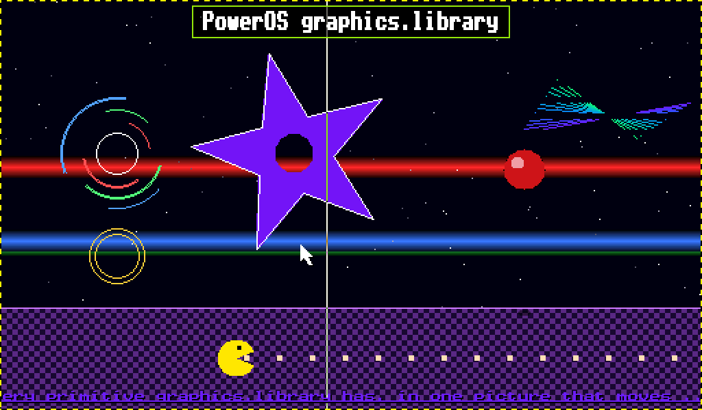
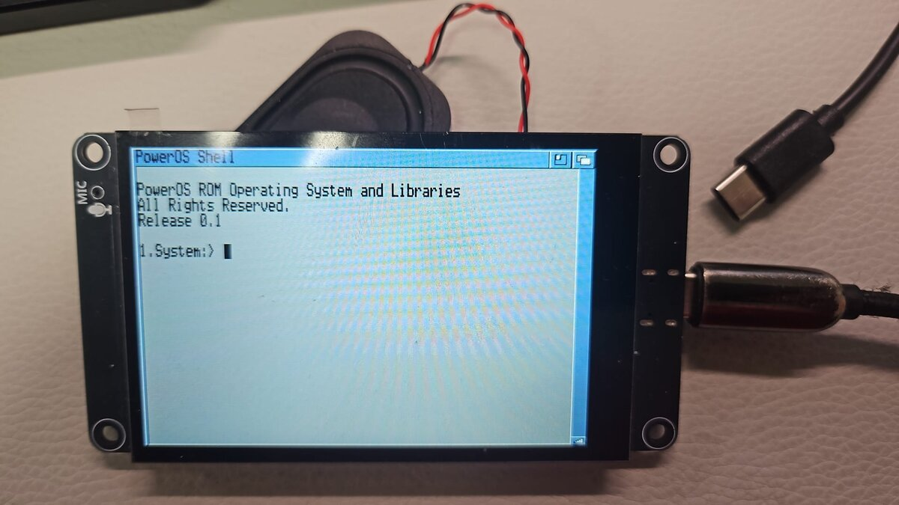
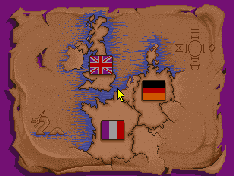
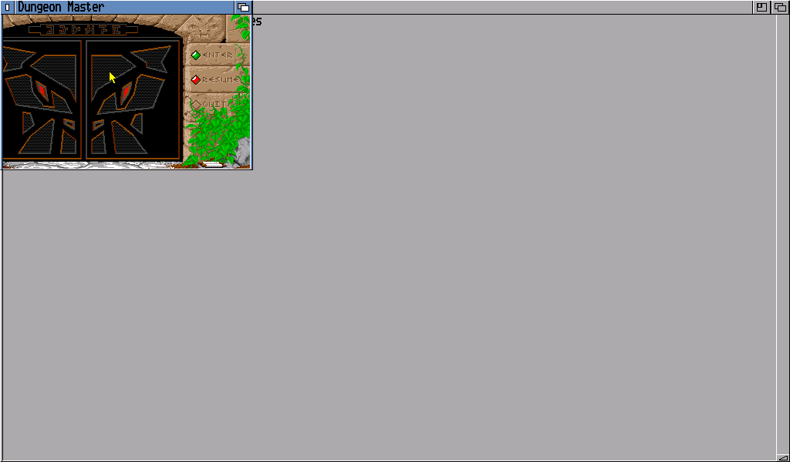
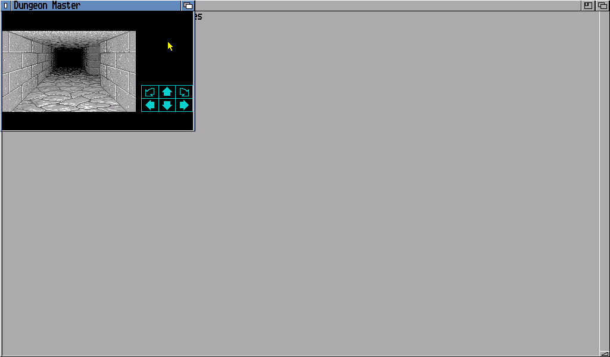
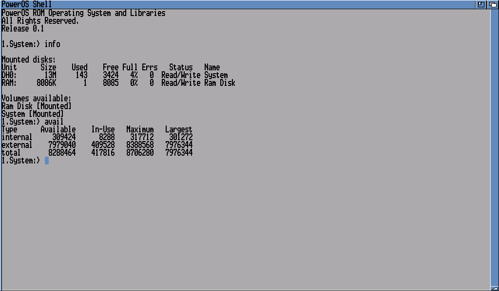
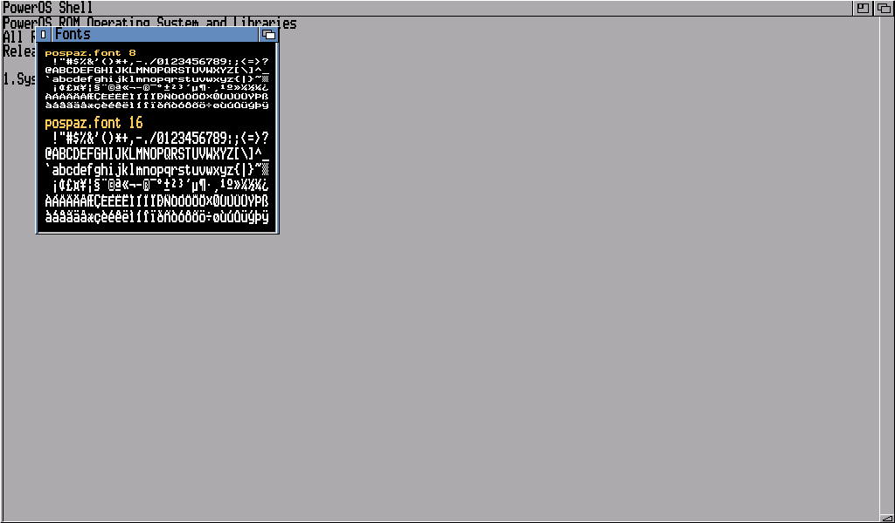
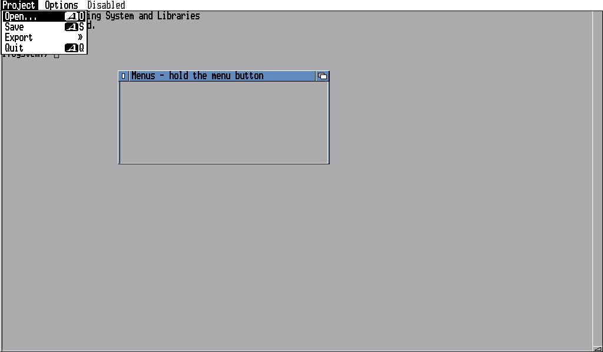
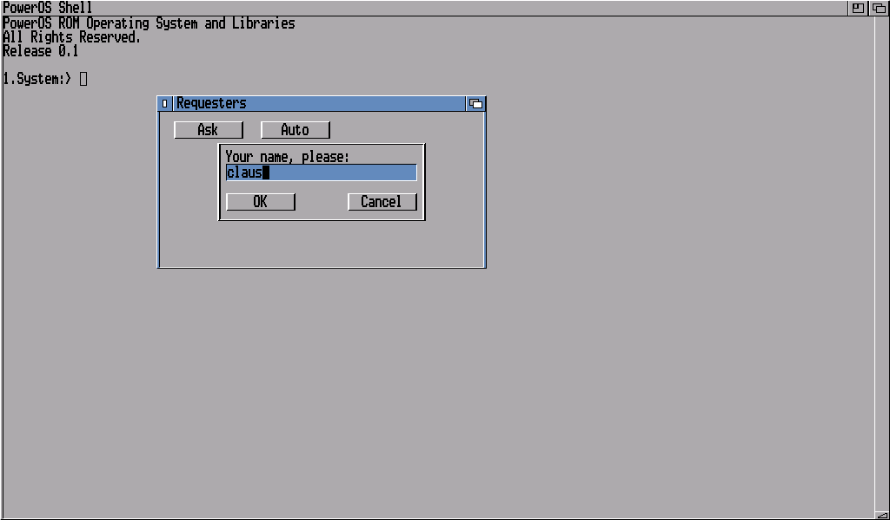
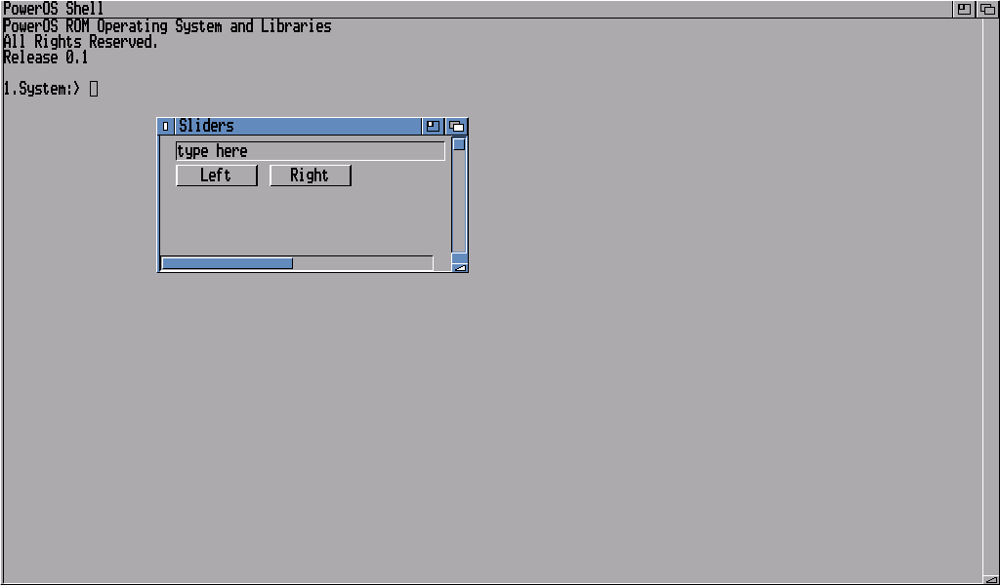

# Screenshots

PowerOS 0.1 on a board, and in Espressif's QEMU. The screenshots are
QEMU's (`./zig build qemu-display`, with the QEMU from
`scripts/build-qemu.sh`), on the 1024×600 display the Waveshare 7" board
has. Every program shown is on the flash disk and runs from there.

## Graphics: `C:test/Anim`

graphics.library in one moving picture: filled polygons with a hole
(the star), circles and arcs, lines with patterns, a ball blitted through a
mask, gradients, a tiled background, text measured and drawn in bold, and a
scroller in italic and underlined - everything in one RastPort, redrawn
every frame.

## On the board

The LCDwiki ES3C35P, an ESP32-S3 with a 3.5" 480×320 panel, running
PowerOS 0.1: the shell window just after boot, on the system's own font.
The speaker beside it is the board's; the machine is powered and its
serial console reached over the USB cable.

## A game: Dungeon Master

A minute of play, full screen: the language, the door, into the dungeon
and a few steps. The same as a video: [dm.mp4](dm.mp4).

Dungeon Master, built against the SDK in a repository of its own and put
on the disk with its data files, running in a window of its own beside the
shell: the title with its door, and the first corridor of the dungeon. It
is started from the shell with `cd SYS:dm`, `Stack 65536` and
`Run dm window`.

## The shell

The machine comes up in a shell window. `Info` lists the mounted disks -
the flash disk `DH0:` named `System`, and `RAM:` - and `Avail` the memory:
internal SRAM and the 8 MiB of PSRAM. The blue block is the cursor.

## Fonts: `C:test/Fonts`

The system's font, `pospaz.font`, at 8 and 16 rows: every character from
32 to 255. The 16-row size is the 8-row one with every row drawn twice,
and it is the screen's default.

## Menus: `C:test/Intuition MENUS`

A window's menus, shown in the screen's title bar while the menu button is
held: items with keyboard shortcuts, an item that opens a submenu (»), and
a menu that is disabled.

## A requester: `C:test/Intuition REQUESTER`

A requester inside a window: text, a string field being typed into, and
two buttons that end it.

## Gadgets: `C:test/Intuition SLIDERS`

Sliders in the window's borders, a string field, and two framed buttons in
a group gadget - each an object of one of intuition's gadget classes.
