# How the modules use each other

Which library, device, resource and handler opens which, in three charts:
the ROM, the modules on the disk, and the classes. An arrow goes from a
module to one it opens and calls. A dashed arrow is a module opened by a
name that arrives at run time - from a mount entry, a caller, an
interface's file or a file's type - drawn to the ones it is on this
machine.

Three are left out because nearly everything uses them:

- **exec.library**, which every module is built on;
- **utility.library**, for tag lists, hooks and dates;
- **expansion.library**, which every driver asks for its part of the
  board - the display drivers, i2c, audio, touch, keyboard, mouse,
  flash, gpio, expander, rs485, sdcard, openeth and wifi - and graphics,
  intuition and con-handler read the board from.

platform.resource and watchdog.resource are opened by programs only, and
appear in no chart.

Colours: libraries blue, devices green, resources amber, handlers pink,
classes violet. Grey is a ROM module in a chart about the disk.

## The ROM

```mermaid
flowchart TB
    n_shell["Shell"]
    n_con["con-handler"]
    n_ram["ram-handler"]
    n_nil["nil-handler"]
    n_pipe["pipe-handler"]
    n_flashfs["flashfs-handler"]
    n_ramlib["ramlib"]
    n_dos["dos.library"]
    n_console["console.device"]
    n_intuition["intuition.library"]
    n_layers["layers.library"]
    n_graphics["graphics.library"]
    n_rtg["rtg.library"]
    n_drivers["display drivers"]
    n_keymap["keymap.library"]
    n_motion["motion.library"]
    n_input["input.device"]
    n_keyboard["keyboard.device"]
    n_mouse["mouse.device"]
    n_touch["touch.device"]
    n_audio["audio.device"]
    n_serial["serial.device"]
    n_usbserial["usbserial.device"]
    n_flash["flash.device"]
    n_timer["timer.device"]
    n_i2c["i2c.device"]
    n_expander["expander.resource"]
    n_gpio["gpio.resource"]
    n_dma["dma.resource"]

    n_shell --> n_dos
    n_con --> n_dos
    n_con --> n_intuition
    n_con --> n_console
    n_con --> n_serial
    n_con --> n_usbserial
    n_con --> n_timer
    n_ram --> n_dos
    n_nil --> n_dos
    n_pipe --> n_dos
    n_flashfs --> n_dos
    n_flashfs -.-> n_flash
    n_ramlib --> n_dos
    n_dos --> n_intuition
    n_dos --> n_flash
    n_dos --> n_timer
    n_console --> n_intuition
    n_console --> n_layers
    n_console --> n_graphics
    n_console --> n_input
    n_console --> n_keymap
    n_intuition --> n_layers
    n_intuition --> n_graphics
    n_intuition --> n_rtg
    n_intuition --> n_input
    n_intuition --> n_keymap
    n_intuition --> n_motion
    n_intuition --> n_timer
    n_layers --> n_graphics
    n_graphics --> n_rtg
    n_drivers --> n_rtg
    n_drivers --> n_i2c
    n_drivers --> n_expander
    n_drivers --> n_gpio
    n_drivers --> n_dma
    n_drivers --> n_timer
    n_motion --> n_timer
    n_input --> n_keyboard
    n_input --> n_mouse
    n_input --> n_touch
    n_input --> n_timer
    n_keyboard --> n_timer
    n_mouse --> n_timer
    n_touch --> n_i2c
    n_touch --> n_expander
    n_touch --> n_gpio
    n_touch --> n_timer
    n_audio --> n_i2c
    n_audio --> n_gpio
    n_audio --> n_dma
    n_audio --> n_timer
    n_serial --> n_timer
    n_expander --> n_i2c
    n_i2c --> n_gpio

    classDef lib fill:#dbeafe,stroke:#2563eb,color:#111827
    classDef dev fill:#dcfce7,stroke:#16a34a,color:#111827
    classDef res fill:#fef3c7,stroke:#d97706,color:#111827
    classDef hand fill:#fce7f3,stroke:#db2777,color:#111827
    class n_ramlib,n_dos,n_intuition,n_layers,n_graphics,n_rtg,n_drivers,n_keymap,n_motion lib
    class n_console,n_input,n_keyboard,n_mouse,n_touch,n_audio,n_serial,n_usbserial,n_flash,n_timer,n_i2c dev
    class n_expander,n_gpio,n_dma res
    class n_shell,n_con,n_ram,n_nil,n_pipe,n_flashfs hand
```

- **The display drivers** are the board's: rgbboard on the 7B, dcsboard
  on the ES3C35P, qemuboard in QEMU, and the command buses a panel is
  spoken to over - qspibus, and i2cbus over i2c.device. Each opens only
  what its panel needs.
- **ramlib** sits in front of `OpenLibrary` and `OpenDevice`: a library
  or device not in memory it loads from `LIBS:` or `DEVS:` through
  dos.library. A handler on the disk dos loads from `HANDLERS:` itself.
- **dos.library** opens flash.device at boot to mount the flash disk's
  partitions, and intuition.library when an error is asked about on the
  screen.
  It starts each handler the first time its device is used, and reaches
  it by packets, not by opening it.
- **input.device** reads keyboard, mouse and touch.device - whichever the
  board has - and hands their events down its chain of handlers,
  intuition's among them.

## On the disk

```mermaid
flowchart TB
    n_asl["asl.library"]
    n_datatypes["datatypes.library"]
    n_diskfont["diskfont.library"]
    n_truetype["truetype.library"]
    n_iffparse["iffparse.library"]
    n_clipboard["clipboard.device"]
    n_modbus["modbus.library"]
    n_rdb["rdb.library"]
    n_telnet["telnet.device"]
    n_tls["tls.library"]
    n_bsdsocket["bsdsocket.library"]
    n_crypto["crypto.library"]
    n_openeth["openeth.device"]
    n_wifi["wifi.device"]
    n_rs485["rs485.device"]
    n_fat["fat-handler"]
    n_sdcard["sdcard.device"]
    n_gadgets["gadget classes"]
    n_dtclasses["datatype classes"]

    r_intuition["intuition.library"]
    r_graphics["graphics.library"]
    r_dos["dos.library"]
    r_input["input.device"]
    r_timer["timer.device"]
    r_flash["flash.device"]
    r_expander["expander.resource"]
    r_gpio["gpio.resource"]
    r_dma["dma.resource"]

    n_asl --> r_intuition
    n_asl --> r_graphics
    n_asl --> r_dos
    n_asl --> n_diskfont
    n_asl --> n_gadgets
    n_datatypes --> r_intuition
    n_datatypes --> r_graphics
    n_datatypes --> r_dos
    n_datatypes --> n_iffparse
    n_datatypes -.-> n_dtclasses
    n_diskfont --> r_graphics
    n_diskfont --> r_dos
    n_diskfont --> n_truetype
    n_iffparse --> r_dos
    n_iffparse --> n_clipboard
    n_clipboard --> r_dos
    n_modbus --> r_dos
    n_modbus --> n_bsdsocket
    n_modbus -.-> n_rs485
    n_rdb -.-> n_sdcard
    n_rdb -.-> r_flash
    n_telnet --> n_bsdsocket
    n_tls --> r_dos
    n_tls --> n_crypto
    n_tls -.-> n_bsdsocket
    n_bsdsocket --> r_dos
    n_bsdsocket --> r_timer
    n_bsdsocket --> n_crypto
    n_bsdsocket -.-> n_openeth
    n_bsdsocket -.-> n_wifi
    n_openeth --> r_timer
    n_wifi --> r_timer
    n_wifi --> n_crypto
    n_rs485 --> r_gpio
    n_rs485 --> r_timer
    n_fat --> r_dos
    n_fat -.-> n_sdcard
    n_sdcard --> r_input
    n_sdcard --> r_timer
    n_sdcard --> r_expander
    n_sdcard --> r_gpio
    n_sdcard --> r_dma

    classDef lib fill:#dbeafe,stroke:#2563eb,color:#111827
    classDef dev fill:#dcfce7,stroke:#16a34a,color:#111827
    classDef hand fill:#fce7f3,stroke:#db2777,color:#111827
    classDef cls fill:#ede9fe,stroke:#7c3aed,color:#111827
    classDef rom fill:#f3f4f6,stroke:#9ca3af,color:#374151
    class n_asl,n_datatypes,n_diskfont,n_truetype,n_iffparse,n_modbus,n_rdb,n_tls,n_bsdsocket,n_crypto lib
    class n_clipboard,n_telnet,n_openeth,n_wifi,n_rs485,n_sdcard dev
    class n_fat hand
    class n_gadgets,n_dtclasses cls
    class r_intuition,r_graphics,r_dos,r_input,r_timer,r_flash,r_expander,r_gpio,r_dma rom
```

- **bsdsocket.library** opens the network device an interface is added
  with, as its file in `DEVS:NetInterfaces/` names it: openeth.device in
  QEMU, wifi.device on a board.
- **tls.library** opens no socket library of its own: a session runs over
  the caller's bsdsocket.library base and a socket the caller connected.
- **modbus.library** opens bsdsocket.library for Modbus TCP, and for RTU
  the device the caller names - rs485.device on this machine.
- **rdb.library** opens the disk its caller names - flash.device or
  sdcard.device - and **fat-handler** the device in its mount entry,
  sdcard.device for `SD0:`.
- **sdcard.device** opens input.device to say when a card goes in or
  comes out.

## The classes

```mermaid
flowchart TB
    r_datatypes["datatypes.library"]
    r_intuition["intuition.library"]
    r_asl["asl.library"]
    r_iffparse["iffparse.library"]
    r_diskfont["diskfont.library"]
    r_layers["layers.library"]
    r_motion["motion.library"]
    r_input["input.device"]
    r_keymap["keymap.library"]
    r_dos["dos.library"]
    r_timer["timer.device"]

    d_picture["picture.datatype"]
    d_text["text.datatype"]
    d_animation["animation.datatype"]
    d_png["png.datatype"]
    d_jpeg["jpeg.datatype"]
    d_gif["gif.datatype"]
    d_bmp["bmp.datatype"]
    d_ilbm["ilbm.datatype"]
    d_ascii["ascii.datatype"]
    d_markdown["markdown.datatype"]
    d_gifanim["gifanim.datatype"]
    d_lottie["lottie.datatype"]

    g_string["string.gadget"]
    g_integer["integer.gadget"]
    g_scroller["scroller.gadget"]
    g_listview["listview.gadget"]
    g_chooser["chooser.gadget"]
    g_fuelgauge["fuelgauge.gadget"]
    g_spinner["spinner.gadget"]
    g_keyboard["keyboard.gadget"]
    g_text["text.gadget"]
    g_calendar["calendar.gadget"]
    g_checkbox["checkbox.gadget"]
    g_cycle["cycle.gadget"]
    g_palette["palette.gadget"]

    d_picture --> r_datatypes
    d_picture --> r_iffparse
    d_text --> r_datatypes
    d_text --> r_iffparse
    d_animation --> r_datatypes
    d_animation --> r_motion
    d_animation --> r_timer
    d_animation --> r_dos
    d_png --> d_picture
    d_jpeg --> d_picture
    d_gif --> d_picture
    d_bmp --> d_picture
    d_ilbm --> d_picture
    d_ilbm --> r_iffparse
    d_ascii --> d_text
    d_ascii --> r_iffparse
    d_markdown --> d_text
    d_gifanim --> d_animation
    d_lottie --> d_animation

    r_asl --> g_checkbox
    r_asl --> g_cycle
    r_asl --> g_listview
    r_asl --> g_palette
    r_asl --> g_scroller
    r_asl --> g_string
    r_asl --> g_text
    r_intuition -.-> g_keyboard
    g_integer --> g_string
    g_listview --> g_scroller
    g_listview --> r_motion
    g_scroller --> r_motion
    g_fuelgauge --> r_motion
    g_spinner --> r_motion
    g_chooser --> r_layers
    g_keyboard --> r_input
    g_keyboard --> r_keymap
    g_text --> r_diskfont
    g_calendar --> r_dos

    classDef cls fill:#ede9fe,stroke:#7c3aed,color:#111827
    classDef rom fill:#f3f4f6,stroke:#9ca3af,color:#374151
    classDef lib fill:#dbeafe,stroke:#2563eb,color:#111827
    class d_picture,d_text,d_animation,d_png,d_jpeg,d_gif,d_bmp,d_ilbm,d_ascii,d_markdown,d_gifanim,d_lottie cls
    class g_string,g_integer,g_scroller,g_listview,g_chooser,g_fuelgauge,g_spinner,g_keyboard,g_text,g_calendar,g_checkbox,g_cycle,g_palette cls
    class r_datatypes,r_asl,r_iffparse,r_diskfont lib
    class r_intuition,r_layers,r_motion,r_input,r_keymap,r_dos,r_timer rom
```

- **A datatype class opens its superclass.** picture, text and animation
  are made on datatypes.library's own class; the file formats are made
  on them. datatypes.library opens the class a file's type names, and
  the class opens its superclass in turn. The format classes read their
  files through dos.library as well.
- **Every gadget class opens intuition, graphics and utility.library**,
  through the class library they are built on
  ([`classlibrary.zig`](../libs/gadgets/classlibrary.zig)); its superclass
  is one of intuition's own (gadgetclass, buttongclass, groupgclass).
  The chart shows the classes that open something besides, and the ones
  asl.library uses; the others - slider, radiobutton, meter, arc and
  the rest - open those three alone.
- **intuition.library** opens keyboard.gadget for the on-screen keyboard,
  and **asl.library** builds its requesters from seven gadget classes.
