# How the modules use each other

Which library, device, resource and handler opens which, in three charts:
the ROM, the modules on the disk, and the classes. An arrow goes from a
module to one its code names - by a constant that holds the name, or the
name itself - to open and call it. A dashed arrow is a module opened by
a name that arrives at run time - from a mount entry, a caller, an
interface's file or a file's type - drawn to the ones it is on this
machine.

The charts are made from the source: `./zig build modchart` writes them,
and `./zig build test` fails when one is out of date.

Three are left out because nearly everything uses them:

- **exec.library**, which every module is built on;
- **utility.library**, for tag lists, hooks and dates;
- **expansion.library**, which every driver asks for its part of the
  board.

A module no arrow touches is in no chart: platform.resource and
watchdog.resource, for one, which only programs open.

Colours: libraries blue, devices green, resources amber, handlers pink,
classes violet. Grey is a ROM module in a chart about the disk.

## The ROM

```mermaid
flowchart TB
    m_Shell["Shell"]
    m_audio_device["audio.device"]
    m_con_handler["con-handler"]
    m_console_device["console.device"]
    m_display_drivers["display drivers"]
    m_dma_resource["dma.resource"]
    m_dos_library["dos.library"]
    m_expander_resource["expander.resource"]
    m_flash_device["flash.device"]
    m_flashfs_handler["flashfs-handler"]
    m_gpio_resource["gpio.resource"]
    m_graphics_library["graphics.library"]
    m_i2c_device["i2c.device"]
    m_input_device["input.device"]
    m_intuition_library["intuition.library"]
    m_keyboard_device["keyboard.device"]
    m_keymap_library["keymap.library"]
    m_layers_library["layers.library"]
    m_motion_library["motion.library"]
    m_mouse_device["mouse.device"]
    m_nil_handler["nil-handler"]
    m_pipe_handler["pipe-handler"]
    m_ram_handler["ram-handler"]
    m_ramlib_library["ramlib.library"]
    m_rtg_library["rtg.library"]
    m_serial_device["serial.device"]
    m_timer_device["timer.device"]
    m_touch_device["touch.device"]
    m_usbserial_device["usbserial.device"]

    m_Shell --> m_dos_library
    m_audio_device --> m_dma_resource
    m_audio_device --> m_gpio_resource
    m_audio_device --> m_i2c_device
    m_audio_device --> m_timer_device
    m_con_handler --> m_console_device
    m_con_handler --> m_dos_library
    m_con_handler --> m_intuition_library
    m_con_handler --> m_serial_device
    m_con_handler --> m_timer_device
    m_con_handler --> m_usbserial_device
    m_console_device --> m_graphics_library
    m_console_device --> m_input_device
    m_console_device --> m_intuition_library
    m_console_device --> m_keymap_library
    m_console_device --> m_layers_library
    m_display_drivers --> m_dma_resource
    m_display_drivers --> m_expander_resource
    m_display_drivers --> m_gpio_resource
    m_display_drivers --> m_i2c_device
    m_display_drivers --> m_rtg_library
    m_display_drivers --> m_timer_device
    m_dos_library --> m_flash_device
    m_dos_library --> m_intuition_library
    m_dos_library --> m_timer_device
    m_expander_resource --> m_i2c_device
    m_flashfs_handler --> m_dos_library
    m_flashfs_handler -.-> m_flash_device
    m_graphics_library --> m_rtg_library
    m_i2c_device --> m_gpio_resource
    m_input_device --> m_keyboard_device
    m_input_device --> m_mouse_device
    m_input_device --> m_timer_device
    m_input_device --> m_touch_device
    m_intuition_library --> m_graphics_library
    m_intuition_library --> m_input_device
    m_intuition_library --> m_keymap_library
    m_intuition_library --> m_layers_library
    m_intuition_library --> m_motion_library
    m_intuition_library --> m_rtg_library
    m_intuition_library --> m_timer_device
    m_keyboard_device --> m_timer_device
    m_layers_library --> m_graphics_library
    m_motion_library --> m_timer_device
    m_mouse_device --> m_timer_device
    m_nil_handler --> m_dos_library
    m_pipe_handler --> m_dos_library
    m_ram_handler --> m_dos_library
    m_ramlib_library --> m_dos_library
    m_serial_device --> m_timer_device
    m_touch_device --> m_expander_resource
    m_touch_device --> m_gpio_resource
    m_touch_device --> m_i2c_device
    m_touch_device --> m_timer_device

    classDef lib fill:#dbeafe,stroke:#2563eb,color:#111827
    class m_display_drivers,m_dos_library,m_graphics_library,m_intuition_library,m_keymap_library,m_layers_library,m_motion_library,m_ramlib_library,m_rtg_library lib
    classDef dev fill:#dcfce7,stroke:#16a34a,color:#111827
    class m_audio_device,m_console_device,m_flash_device,m_i2c_device,m_input_device,m_keyboard_device,m_mouse_device,m_serial_device,m_timer_device,m_touch_device,m_usbserial_device dev
    classDef res fill:#fef3c7,stroke:#d97706,color:#111827
    class m_dma_resource,m_expander_resource,m_gpio_resource res
    classDef hand fill:#fce7f3,stroke:#db2777,color:#111827
    class m_Shell,m_con_handler,m_flashfs_handler,m_nil_handler,m_pipe_handler,m_ram_handler hand
```

<!-- modchart rom -->

<!-- modchart end -->

- **The display drivers** are the board's: rgbboard on the 7B, dcsboard
  on the ES3C35P, qemuboard in QEMU, and the command buses a panel is
  spoken to over - qspibus, and i2cbus over i2c.device. Each opens only
  what its panel needs.
- **ramlib.library** sits in front of `OpenLibrary` and `OpenDevice`: a library
  or device not in memory it loads from `LIBS:` or `DEVS:` through
  dos.library. A handler on the disk dos loads from `HANDLERS:` itself.
- **dos.library** opens flash.device at boot to mount the flash disk's
  partitions, and intuition.library when an error is asked about on the
  screen. It starts each handler the first time its device is used, and
  reaches it by packets: no arrow goes to a handler.
- **input.device** reads keyboard, mouse and touch.device - whichever the
  board has - and hands their events down its chain of handlers,
  intuition's among them.

## On the disk

```mermaid
flowchart TB
    m_asl_library["asl.library"]
    m_bsdsocket_library["bsdsocket.library"]
    m_clipboard_device["clipboard.device"]
    m_crypto_library["crypto.library"]
    m_datatype_classes["datatype classes"]
    m_datatypes_library["datatypes.library"]
    m_diskfont_library["diskfont.library"]
    m_dma_resource["dma.resource"]
    m_dos_library["dos.library"]
    m_expander_resource["expander.resource"]
    m_fat_handler["fat-handler"]
    m_flash_device["flash.device"]
    m_gadget_classes["gadget classes"]
    m_gpio_resource["gpio.resource"]
    m_graphics_library["graphics.library"]
    m_iffparse_library["iffparse.library"]
    m_input_device["input.device"]
    m_intuition_library["intuition.library"]
    m_modbus_library["modbus.library"]
    m_openeth_device["openeth.device"]
    m_rdb_library["rdb.library"]
    m_rs485_device["rs485.device"]
    m_sdcard_device["sdcard.device"]
    m_telnet_device["telnet.device"]
    m_timer_device["timer.device"]
    m_tls_library["tls.library"]
    m_truetype_library["truetype.library"]
    m_wifi_device["wifi.device"]

    m_asl_library --> m_diskfont_library
    m_asl_library --> m_dos_library
    m_asl_library --> m_gadget_classes
    m_asl_library --> m_graphics_library
    m_asl_library --> m_intuition_library
    m_bsdsocket_library --> m_crypto_library
    m_bsdsocket_library --> m_dos_library
    m_bsdsocket_library -.-> m_openeth_device
    m_bsdsocket_library --> m_timer_device
    m_bsdsocket_library -.-> m_wifi_device
    m_clipboard_device --> m_dos_library
    m_datatypes_library -.-> m_datatype_classes
    m_datatypes_library --> m_dos_library
    m_datatypes_library --> m_graphics_library
    m_datatypes_library --> m_iffparse_library
    m_datatypes_library --> m_intuition_library
    m_diskfont_library --> m_dos_library
    m_diskfont_library --> m_graphics_library
    m_diskfont_library --> m_truetype_library
    m_fat_handler --> m_dos_library
    m_fat_handler -.-> m_sdcard_device
    m_iffparse_library --> m_clipboard_device
    m_iffparse_library --> m_dos_library
    m_modbus_library --> m_bsdsocket_library
    m_modbus_library --> m_dos_library
    m_modbus_library --> m_rs485_device
    m_openeth_device --> m_timer_device
    m_rdb_library -.-> m_flash_device
    m_rdb_library -.-> m_sdcard_device
    m_rs485_device --> m_gpio_resource
    m_rs485_device --> m_timer_device
    m_sdcard_device --> m_dma_resource
    m_sdcard_device --> m_expander_resource
    m_sdcard_device --> m_gpio_resource
    m_sdcard_device --> m_input_device
    m_sdcard_device --> m_timer_device
    m_telnet_device --> m_bsdsocket_library
    m_tls_library -.-> m_bsdsocket_library
    m_tls_library --> m_crypto_library
    m_tls_library --> m_dos_library
    m_wifi_device --> m_crypto_library
    m_wifi_device --> m_timer_device

    classDef lib fill:#dbeafe,stroke:#2563eb,color:#111827
    class m_asl_library,m_bsdsocket_library,m_crypto_library,m_datatypes_library,m_diskfont_library,m_iffparse_library,m_modbus_library,m_rdb_library,m_tls_library,m_truetype_library lib
    classDef dev fill:#dcfce7,stroke:#16a34a,color:#111827
    class m_clipboard_device,m_openeth_device,m_rs485_device,m_sdcard_device,m_telnet_device,m_wifi_device dev
    classDef hand fill:#fce7f3,stroke:#db2777,color:#111827
    class m_fat_handler hand
    classDef cls fill:#ede9fe,stroke:#7c3aed,color:#111827
    class m_datatype_classes,m_gadget_classes cls
    classDef rom fill:#f3f4f6,stroke:#9ca3af,color:#374151
    class m_dma_resource,m_dos_library,m_expander_resource,m_flash_device,m_gpio_resource,m_graphics_library,m_input_device,m_intuition_library,m_timer_device rom
```

<!-- modchart disk -->

<!-- modchart end -->

- **bsdsocket.library** opens the network device an interface is added
  with, as its file in `DEVS:NetInterfaces/` names it: openeth.device in
  QEMU, wifi.device on a board.
- **tls.library** opens no socket library of its own: a session runs over
  the caller's bsdsocket.library base and a socket the caller connected.
- **modbus.library** opens bsdsocket.library for Modbus TCP, and for RTU
  the device the caller names, rs485.device unless told otherwise.
- **rdb.library** opens the disk its caller names - flash.device or
  sdcard.device - and **fat-handler** the device in its mount entry,
  sdcard.device for `SD0:`.
- **sdcard.device** opens input.device to say when a card goes in or
  comes out.

## The classes

```mermaid
flowchart TB
    m_animation_datatype["animation.datatype"]
    m_ascii_datatype["ascii.datatype"]
    m_asl_library["asl.library"]
    m_bmp_datatype["bmp.datatype"]
    m_calendar_gadget["calendar.gadget"]
    m_checkbox_gadget["checkbox.gadget"]
    m_chooser_gadget["chooser.gadget"]
    m_cycle_gadget["cycle.gadget"]
    m_datatypes_library["datatypes.library"]
    m_diskfont_library["diskfont.library"]
    m_dos_library["dos.library"]
    m_fuelgauge_gadget["fuelgauge.gadget"]
    m_gif_datatype["gif.datatype"]
    m_gifanim_datatype["gifanim.datatype"]
    m_iffparse_library["iffparse.library"]
    m_ilbm_datatype["ilbm.datatype"]
    m_input_device["input.device"]
    m_integer_gadget["integer.gadget"]
    m_intuition_library["intuition.library"]
    m_jpeg_datatype["jpeg.datatype"]
    m_keyboard_gadget["keyboard.gadget"]
    m_keymap_library["keymap.library"]
    m_layers_library["layers.library"]
    m_listview_gadget["listview.gadget"]
    m_lottie_datatype["lottie.datatype"]
    m_markdown_datatype["markdown.datatype"]
    m_motion_library["motion.library"]
    m_palette_gadget["palette.gadget"]
    m_picture_datatype["picture.datatype"]
    m_png_datatype["png.datatype"]
    m_scroller_gadget["scroller.gadget"]
    m_spinner_gadget["spinner.gadget"]
    m_string_gadget["string.gadget"]
    m_text_datatype["text.datatype"]
    m_text_gadget["text.gadget"]
    m_timer_device["timer.device"]

    m_animation_datatype --> m_datatypes_library
    m_animation_datatype --> m_dos_library
    m_animation_datatype --> m_motion_library
    m_animation_datatype --> m_timer_device
    m_ascii_datatype --> m_dos_library
    m_ascii_datatype --> m_iffparse_library
    m_ascii_datatype --> m_text_datatype
    m_asl_library --> m_checkbox_gadget
    m_asl_library --> m_cycle_gadget
    m_asl_library --> m_listview_gadget
    m_asl_library --> m_palette_gadget
    m_asl_library --> m_scroller_gadget
    m_asl_library --> m_string_gadget
    m_asl_library --> m_text_gadget
    m_bmp_datatype --> m_dos_library
    m_bmp_datatype --> m_picture_datatype
    m_calendar_gadget --> m_dos_library
    m_chooser_gadget --> m_layers_library
    m_fuelgauge_gadget --> m_motion_library
    m_gif_datatype --> m_dos_library
    m_gif_datatype --> m_picture_datatype
    m_gifanim_datatype --> m_animation_datatype
    m_gifanim_datatype --> m_dos_library
    m_ilbm_datatype --> m_dos_library
    m_ilbm_datatype --> m_iffparse_library
    m_ilbm_datatype --> m_picture_datatype
    m_integer_gadget --> m_string_gadget
    m_intuition_library --> m_keyboard_gadget
    m_jpeg_datatype --> m_dos_library
    m_jpeg_datatype --> m_picture_datatype
    m_keyboard_gadget --> m_input_device
    m_keyboard_gadget --> m_keymap_library
    m_listview_gadget --> m_motion_library
    m_listview_gadget --> m_scroller_gadget
    m_lottie_datatype --> m_animation_datatype
    m_lottie_datatype --> m_dos_library
    m_markdown_datatype --> m_dos_library
    m_markdown_datatype --> m_text_datatype
    m_picture_datatype --> m_datatypes_library
    m_picture_datatype --> m_iffparse_library
    m_png_datatype --> m_dos_library
    m_png_datatype --> m_picture_datatype
    m_scroller_gadget --> m_motion_library
    m_spinner_gadget --> m_motion_library
    m_text_datatype --> m_datatypes_library
    m_text_datatype --> m_iffparse_library
    m_text_gadget --> m_diskfont_library

    classDef lib fill:#dbeafe,stroke:#2563eb,color:#111827
    class m_asl_library,m_datatypes_library,m_diskfont_library,m_iffparse_library lib
    classDef cls fill:#ede9fe,stroke:#7c3aed,color:#111827
    class m_animation_datatype,m_ascii_datatype,m_bmp_datatype,m_calendar_gadget,m_checkbox_gadget,m_chooser_gadget,m_cycle_gadget,m_fuelgauge_gadget,m_gif_datatype,m_gifanim_datatype,m_ilbm_datatype,m_integer_gadget,m_jpeg_datatype,m_keyboard_gadget,m_listview_gadget,m_lottie_datatype,m_markdown_datatype,m_palette_gadget,m_picture_datatype,m_png_datatype,m_scroller_gadget,m_spinner_gadget,m_string_gadget,m_text_datatype,m_text_gadget cls
    classDef rom fill:#f3f4f6,stroke:#9ca3af,color:#374151
    class m_dos_library,m_input_device,m_intuition_library,m_keymap_library,m_layers_library,m_motion_library,m_timer_device rom
```

<!-- modchart classes -->

<!-- modchart end -->

- **A datatype class opens its superclass.** picture, text and animation
  are made on datatypes.library's own class; the file formats are made
  on them. datatypes.library opens the class a file's type names, and
  the class opens its superclass in turn.
- **Every gadget class opens intuition, graphics and utility.library**,
  through the class library they are built on
  ([`classlibrary.zig`](../libs/gadgets/classlibrary.zig)); its superclass
  is one of intuition's own (gadgetclass, buttongclass, groupgclass).
  The chart shows the classes that open something besides, and the ones
  asl.library uses; the others - slider, radiobutton, meter, arc and
  the rest - open those three alone.
- **intuition.library** opens keyboard.gadget for the on-screen keyboard,
  and **asl.library** builds its requesters from seven gadget classes.
